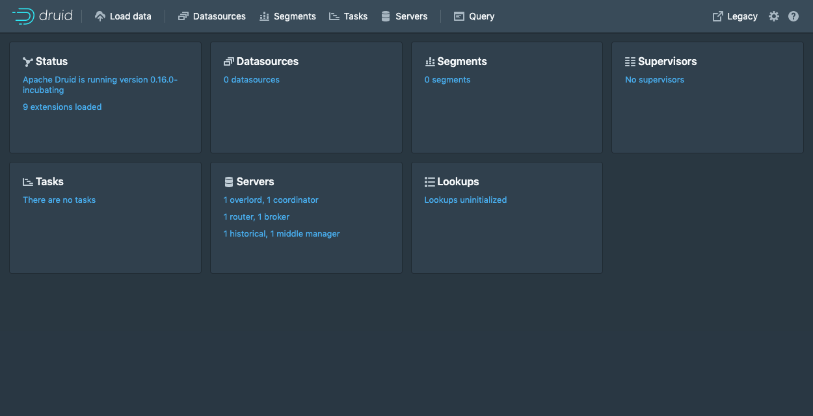

<!-- toc -->
## Docker

在这个部分中，我们将从 [Docker Hub](https://hub.docker.com/r/apache/druid) 下载Apache Druid镜像，并使用 [Docker](https://www.docker.com/get-started) 和 [Docker Compose](https://docs.docker.com/compose/) 在一台机器上安装它。完成此初始设置后，集群将准备好加载数据。

在开始快速启动之前，阅读 [Druid概述](chapter-1.md) 和 [摄取概述](../DataIngestion/ingestion.md) 是很有帮助的，因为教程将参考这些页面上讨论的概念。此外，建议熟悉Docker。

<ins class="adsbygoogle"
     style="display:block; text-align:center;"
     data-ad-layout="in-article"
     data-ad-format="fluid"
     data-ad-client="ca-pub-8828078415045620"
     data-ad-slot="7586680510"></ins>

### 前提条件

* Docker

### 快速开始

Druid源代码包含一个 [示例docker-compose.yml](https://github.com/apache/druid/blob/master/distribution/docker/docker-compose.yml) 它可以从Docker Hub中提取一个镜像，适合用作示例环境，并用于试验基于Docker的Druid配置和部署。

#### Compose文件

示例 `docker-compose.yml` 将为每个Druid服务创建一个容器，包括Zookeeper和作为元数据存储PostgreSQL容器。深度存储将是本地目录，默认配置为相对于 `docker-compose.yml`文件的 `./storage`，并将作为 `/opt/data` 挂载，并在需要访问深层存储的Druid容器之间共享。Druid容器是通过 [环境文件](https://github.com/apache/druid/blob/master/distribution/docker/environment) 配置的。

#### 配置

Druid Docker容器的配置是通过环境变量完成的，环境变量还可以指定到 [标准Druid配置文件](../Configuration/configuration.md) 的路径

特殊环境变量：

* `JAVA_OPTS` -- 设置 java options
* `DRUID_LOG4J` -- 设置完成的 `log4j.xml`
* `DRUID_LOG_LEVEL` -- 覆盖在log4j中的默认日志级别
* `DRUID_XMX` -- 设置 Java `Xmx`
* `DRUID_XMS` -- 设置 Java `Xms`
* `DRUID_MAXNEWSIZE` -- 设置 Java最大新生代大小
* `DRUID_NEWSIZE` -- 设置 Java 新生代大小
* `DRUID_MAXDIRECTMEMORYSIZE` -- 设置Java最大直接内存大小
* `DRUID_CONFIG_COMMON` -- druid "common"属性文件的完整路径
* `DRUID_CONFIG_${service}` -- druid "service"属性文件的完整路径

除了特殊的环境变量外，在容器中启动Druid的脚本还将尝试使用以 `druid_`前缀开头的任何环境变量作为命令行配置。例如，Druid容器进程中的环境变量`druid_metadata_storage_type=postgresql` 将被转换为 `-Ddruid.metadata.storage.type=postgresql` 

Druid  `docker-compose.yml` 示例使用单个环境文件来指定完整的Druid配置；但是，在生产用例中，我们建议使用 `DRUID_COMMON_CONFIG` 和`DRUID_CONFIG_${service}` 或专门定制的特定于服务的环境文件。

### 启动集群

运行 `docker-compose up` 启动附加shell的集群，或运行 `docker-compose up -d` 在后台运行集群。如果直接使用示例文件，这个命令应该从Druid安装目录中的 `distribution/docker/` 运行。

启动集群后，可以导航到 [http://localhost:8888](http://localhost/) 。服务于 [Druid控制台](../Operations/druid-console.md) 的 [Druid路由进程](../Design/Router.md) 位于这个地址。

所有Druid进程需要几秒钟才能完全启动。如果在启动服务后立即打开控制台，可能会看到一些可以安全忽略的错误。

从这里你可以跟着 [标准教程](chapter-2.md)，或者详细说明你的 `docker-compose.yml` 根据需要添加任何其他外部服务依赖项。