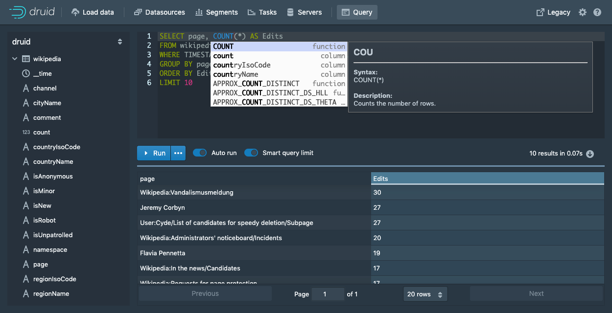
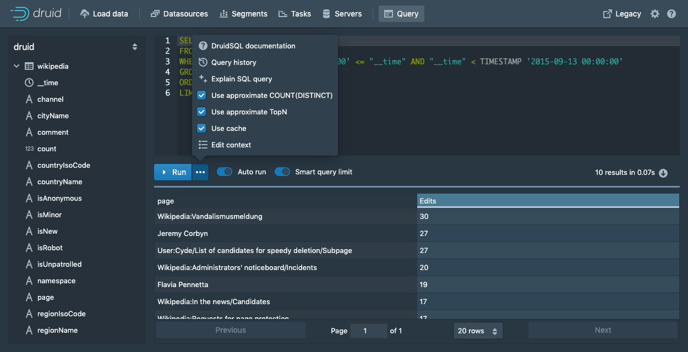
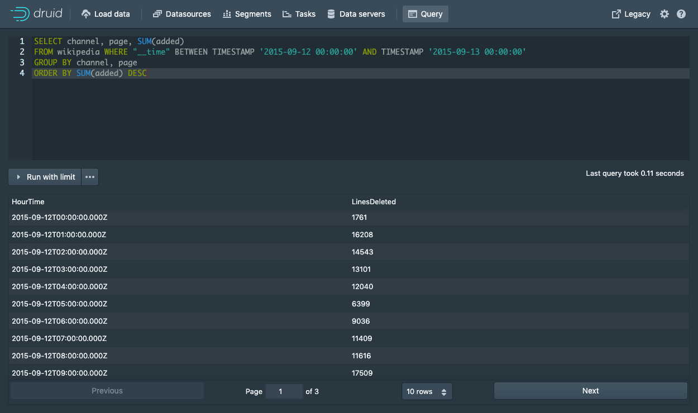
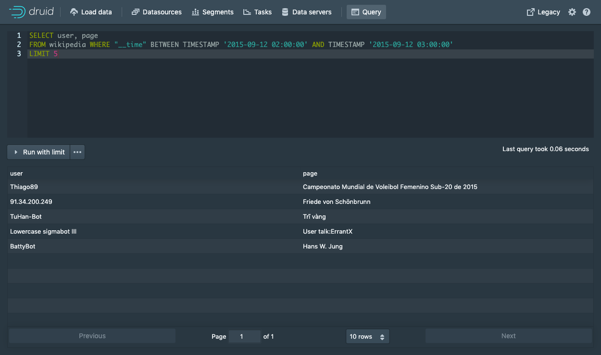
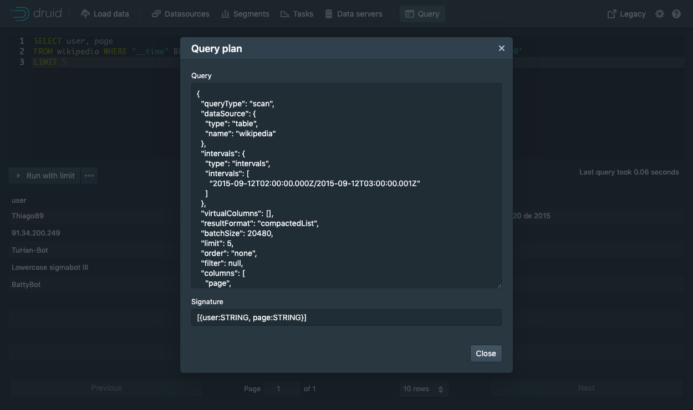
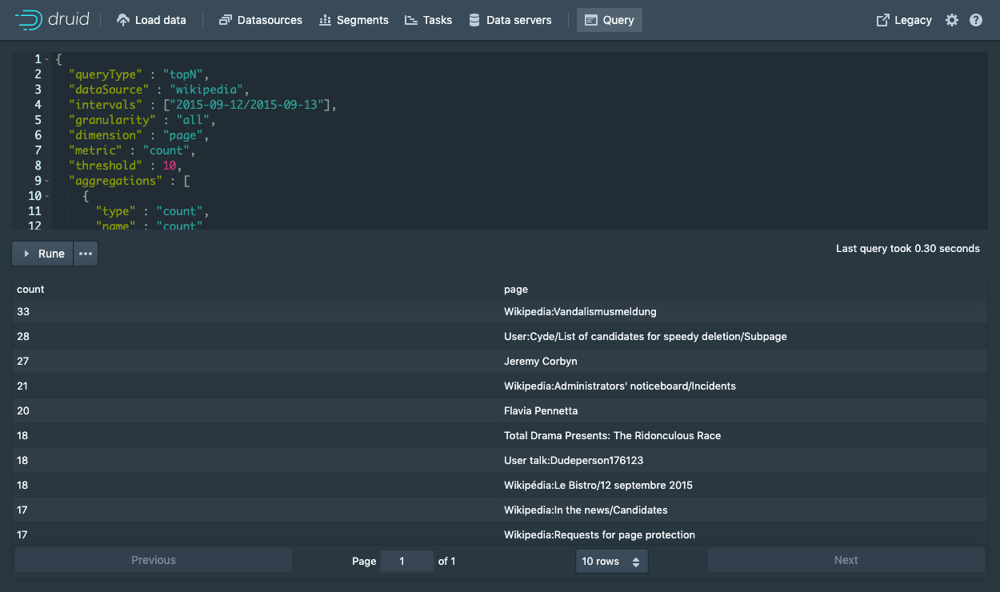

<!-- toc -->

## 查询数据

本教程将以Druid SQL和Druid的原生查询格式的示例演示如何在Apache Druid中查询数据。

本教程假定您已经完成了摄取教程之一，因为我们将查询Wikipedia编辑样例数据。

* [加载本地文件](./chapter-1.md)
* [从Kafka加载数据](./chapter-2.md)
* [从Hadoop加载数据](./chapter-3.md)

Druid查询通过HTTP发送,Druid控制台包括一个视图，用于向Druid发出查询并很好地格式化结果。

### Druid SQL查询

Druid支持SQL查询。

该查询检索了2015年9月12日被编辑最多的10个维基百科页面

```json
SELECT page, COUNT(*) AS Edits
FROM wikipedia
WHERE TIMESTAMP '2015-09-12 00:00:00' <= "__time" AND "__time" < TIMESTAMP '2015-09-13 00:00:00'
GROUP BY page
ORDER BY Edits DESC
LIMIT 10
```

让我们来看几种不同的查询方法

#### 通过控制台查询SQL

您可以通过在控制台中进行上述查询：



控制台查询视图通过内联文档提供自动补全功能。



您还可以从 `...` 选项菜单中配置要与查询一起发送的其他上下文标志。

请注意，控制台将（默认情况下）使用带Limit的SQL查询，以便可以完成诸如`SELECT * FROM wikipedia`之类的查询,您可以通过 `Smart query limit` 切换关闭此行为。


查询视图提供了可以为您编写和修改查询的上下文操作。

#### 通过dsql查询SQL

为方便起见，Druid软件包中包括了一个SQL命令行客户端，位于Druid根目录中的 `bin/dsql`

运行 `bin/dsql`, 可以看到如下：
```json
Welcome to dsql, the command-line client for Druid SQL.
Type "\h" for help.
dsql>
```
将SQl粘贴到 `dsql` 中提交查询：

```json
dsql> SELECT page, COUNT(*) AS Edits FROM wikipedia WHERE "__time" BETWEEN TIMESTAMP '2015-09-12 00:00:00' AND TIMESTAMP '2015-09-13 00:00:00' GROUP BY page ORDER BY Edits DESC LIMIT 10;
┌──────────────────────────────────────────────────────────┬───────┐
│ page                                                     │ Edits │
├──────────────────────────────────────────────────────────┼───────┤
│ Wikipedia:Vandalismusmeldung                             │    33 │
│ User:Cyde/List of candidates for speedy deletion/Subpage │    28 │
│ Jeremy Corbyn                                            │    27 │
│ Wikipedia:Administrators' noticeboard/Incidents          │    21 │
│ Flavia Pennetta                                          │    20 │
│ Total Drama Presents: The Ridonculous Race               │    18 │
│ User talk:Dudeperson176123                               │    18 │
│ Wikipédia:Le Bistro/12 septembre 2015                    │    18 │
│ Wikipedia:In the news/Candidates                         │    17 │
│ Wikipedia:Requests for page protection                   │    17 │
└──────────────────────────────────────────────────────────┴───────┘
Retrieved 10 rows in 0.06s.
```

#### 通过HTTP查询SQL

SQL查询作为JSON通过HTTP提交

教程包括一个示例文件, 该文件`quickstart/tutorial/wikipedia-top-pages-sql.json`包含上面显示的SQL查询, 我们将该查询提交给Druid Broker。

```json
curl -X 'POST' -H 'Content-Type:application/json' -d @quickstart/tutorial/wikipedia-top-pages-sql.json http://localhost:8888/druid/v2/sql
```
结果返回如下：

```json
[
  {
    "page": "Wikipedia:Vandalismusmeldung",
    "Edits": 33
  },
  {
    "page": "User:Cyde/List of candidates for speedy deletion/Subpage",
    "Edits": 28
  },
  {
    "page": "Jeremy Corbyn",
    "Edits": 27
  },
  {
    "page": "Wikipedia:Administrators' noticeboard/Incidents",
    "Edits": 21
  },
  {
    "page": "Flavia Pennetta",
    "Edits": 20
  },
  {
    "page": "Total Drama Presents: The Ridonculous Race",
    "Edits": 18
  },
  {
    "page": "User talk:Dudeperson176123",
    "Edits": 18
  },
  {
    "page": "Wikipédia:Le Bistro/12 septembre 2015",
    "Edits": 18
  },
  {
    "page": "Wikipedia:In the news/Candidates",
    "Edits": 17
  },
  {
    "page": "Wikipedia:Requests for page protection",
    "Edits": 17
  }
]
```

#### 更多Druid SQL示例

这是一组可尝试的查询:

**时间查询**

```json
SELECT FLOOR(__time to HOUR) AS HourTime, SUM(deleted) AS LinesDeleted
FROM wikipedia WHERE "__time" BETWEEN TIMESTAMP '2015-09-12 00:00:00' AND TIMESTAMP '2015-09-13 00:00:00'
GROUP BY 1
```


**聚合查询**

```json
SELECT channel, page, SUM(added)
FROM wikipedia WHERE "__time" BETWEEN TIMESTAMP '2015-09-12 00:00:00' AND TIMESTAMP '2015-09-13 00:00:00'
GROUP BY channel, page
ORDER BY SUM(added) DESC
```



**查询原始数据**

```json
SELECT user, page
FROM wikipedia WHERE "__time" BETWEEN TIMESTAMP '2015-09-12 02:00:00' AND TIMESTAMP '2015-09-12 03:00:00'
LIMIT 5
```



#### SQL查询计划

Druid SQL能够解释给定查询的查询计划, 在控制台中，可以通过 `...` 按钮访问此功能。



如果您以其他方式查询，则可以通过在Druid SQL查询之前添加 `EXPLAIN PLAN FOR` 来获得查询计划。

使用上边的一个示例：

`EXPLAIN PLAN FOR SELECT page, COUNT(*) AS Edits FROM wikipedia WHERE "__time" BETWEEN TIMESTAMP '2015-09-12 00:00:00' AND TIMESTAMP '2015-09-13 00:00:00' GROUP BY page ORDER BY Edits DESC LIMIT 10;`

```json
dsql> EXPLAIN PLAN FOR SELECT page, COUNT(*) AS Edits FROM wikipedia WHERE "__time" BETWEEN TIMESTAMP '2015-09-12 00:00:00' AND TIMESTAMP '2015-09-13 00:00:00' GROUP BY page ORDER BY Edits DESC LIMIT 10;
┌─────────────────────────────────────────────────────────────────────────────────────────────────────────────────────────────────────────────────────────────────────────────────────────────────────────────────────────────────────────────────────────────────────────────────────────────────────────────────────────────────────────────────────────────────────────────────────────────────────────────────────────────────────────────────────────────────────────────────────────────────────────────────────────────────────────────────────────┐
│ PLAN                                                                                                                                                                                                                                                                                                                                                                                                                                                                                                                                                    │
├─────────────────────────────────────────────────────────────────────────────────────────────────────────────────────────────────────────────────────────────────────────────────────────────────────────────────────────────────────────────────────────────────────────────────────────────────────────────────────────────────────────────────────────────────────────────────────────────────────────────────────────────────────────────────────────────────────────────────────────────────────────────────────────────────────────────────────────┤
│ DruidQueryRel(query=[{"queryType":"topN","dataSource":{"type":"table","name":"wikipedia"},"virtualColumns":[],"dimension":{"type":"default","dimension":"page","outputName":"d0","outputType":"STRING"},"metric":{"type":"numeric","metric":"a0"},"threshold":10,"intervals":{"type":"intervals","intervals":["2015-09-12T00:00:00.000Z/2015-09-13T00:00:00.001Z"]},"filter":null,"granularity":{"type":"all"},"aggregations":[{"type":"count","name":"a0"}],"postAggregations":[],"context":{},"descending":false}], signature=[{d0:STRING, a0:LONG}]) │
└─────────────────────────────────────────────────────────────────────────────────────────────────────────────────────────────────────────────────────────────────────────────────────────────────────────────────────────────────────────────────────────────────────────────────────────────────────────────────────────────────────────────────────────────────────────────────────────────────────────────────────────────────────────────────────────────────────────────────────────────────────────────────────────────────────────────────────────┘
Retrieved 1 row in 0.03s.
```

### 原生JSON查询

Druid的原生查询格式以JSON表示。

#### 通过控制台原生查询

您可以从控制台的"Query"视图发出原生Druid查询。

这是一个查询，可检索2015-09-12上具有最多页面编辑量的10个wikipedia页面。

```json
{
  "queryType" : "topN",
  "dataSource" : "wikipedia",
  "intervals" : ["2015-09-12/2015-09-13"],
  "granularity" : "all",
  "dimension" : "page",
  "metric" : "count",
  "threshold" : 10,
  "aggregations" : [
    {
      "type" : "count",
      "name" : "count"
    }
  ]
}
```
只需将其粘贴到控制台即可将编辑器切换到JSON模式。



#### 通过HTTP原生查询

我们在 `quickstart/tutorial/wikipedia-top-pages.json` 文件中包括了一个示例原生TopN查询。

提交该查询到Druid：

```json
curl -X 'POST' -H 'Content-Type:application/json' -d @quickstart/tutorial/wikipedia-top-pages.json http://localhost:8888/druid/v2?pretty
```

您可以看到如下的查询结果：

```json
[ {
  "timestamp" : "2015-09-12T00:46:58.771Z",
  "result" : [ {
    "count" : 33,
    "page" : "Wikipedia:Vandalismusmeldung"
  }, {
    "count" : 28,
    "page" : "User:Cyde/List of candidates for speedy deletion/Subpage"
  }, {
    "count" : 27,
    "page" : "Jeremy Corbyn"
  }, {
    "count" : 21,
    "page" : "Wikipedia:Administrators' noticeboard/Incidents"
  }, {
    "count" : 20,
    "page" : "Flavia Pennetta"
  }, {
    "count" : 18,
    "page" : "Total Drama Presents: The Ridonculous Race"
  }, {
    "count" : 18,
    "page" : "User talk:Dudeperson176123"
  }, {
    "count" : 18,
    "page" : "Wikipédia:Le Bistro/12 septembre 2015"
  }, {
    "count" : 17,
    "page" : "Wikipedia:In the news/Candidates"
  }, {
    "count" : 17,
    "page" : "Wikipedia:Requests for page protection"
  } ]
} ]
```

### 进一步阅读

[查询文档](../Querying/makeNativeQueries.md)有更多关于Druid原生JSON查询的信息
[Druid SQL文档](../Querying/druidsql.md)有更多关于Druid SQL查询的信息