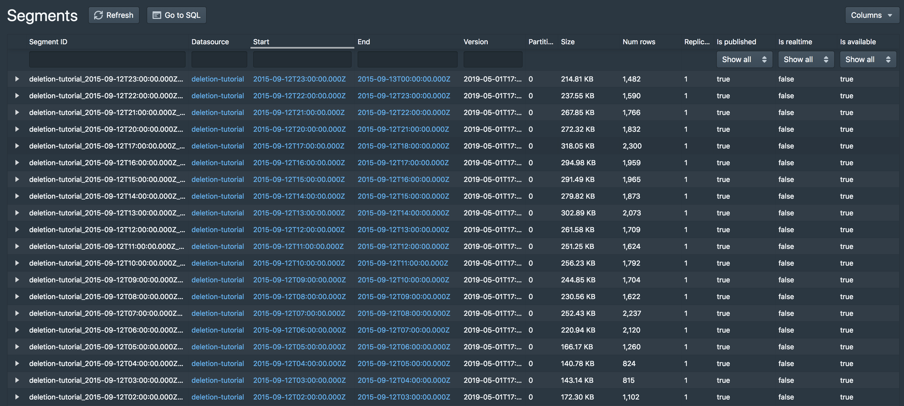

<!-- toc -->

## 数据删除

本教程演示如何删除数据

本教程我们假设您已经按照[单服务器部署](../GettingStarted/chapter-3.md)中描述下载了Druid，并运行在本地机器上。

### 加载初始数据
在本教程中，我们将使用Wikipedia编辑数据，并使用创建每小时段的索引规范

这份规范位于 `quickstart/tutorial/deletion-index.json`, 它将创建一个名称为 `deletion-tutorial` 的数据源

现在加载这份初始数据：
```json
bin/post-index-task --file quickstart/tutorial/deletion-index.json --url http://localhost:8081
```
当加载完成后，在浏览器中访问[http://localhost:8888/unified-console.html#datasources](http://localhost:8888/unified-console.html#datasources)

### 如何永久删除数据

永久删除一个段需要两步：
1. 段必须首先标记为"未使用"。当用户通过Coordinator API手动禁用段时，就会发生这种情况
2. 在段被标记为"未使用"之后，一个Kill任务将从Druid的元数据存储和深层存储中删除任何“未使用”的段

现在让我们通过使用Coordinator API按时间间隔和段id删除一些段。

### 通过时间间隔禁用段

让我们在指定的时间间隔内禁用段。这会将间隔中的所有段标记为"未使用"，但不会将它们从深层存储中移除。让我们禁用间隔  `2015-09-12T18:00:00.000Z/2015-09-12T20:00:00.000Z`中的段，即在18到20小时之间

```json
curl -X 'POST' -H 'Content-Type:application/json' -d '{ "interval" : "2015-09-12T18:00:00.000Z/2015-09-12T20:00:00.000Z" }' http://localhost:8081/druid/coordinator/v1/datasources/deletion-tutorial/markUnused
```

该命令完成后，您应该看到第18和19小时的段已被禁用：


请注意，第18小时和第19小时的数据段仍在深层存储中:

```json
$ ls -l1 var/druid/segments/deletion-tutorial/
2015-09-12T00:00:00.000Z_2015-09-12T01:00:00.000Z
2015-09-12T01:00:00.000Z_2015-09-12T02:00:00.000Z
2015-09-12T02:00:00.000Z_2015-09-12T03:00:00.000Z
2015-09-12T03:00:00.000Z_2015-09-12T04:00:00.000Z
2015-09-12T04:00:00.000Z_2015-09-12T05:00:00.000Z
2015-09-12T05:00:00.000Z_2015-09-12T06:00:00.000Z
2015-09-12T06:00:00.000Z_2015-09-12T07:00:00.000Z
2015-09-12T07:00:00.000Z_2015-09-12T08:00:00.000Z
2015-09-12T08:00:00.000Z_2015-09-12T09:00:00.000Z
2015-09-12T09:00:00.000Z_2015-09-12T10:00:00.000Z
2015-09-12T10:00:00.000Z_2015-09-12T11:00:00.000Z
2015-09-12T11:00:00.000Z_2015-09-12T12:00:00.000Z
2015-09-12T12:00:00.000Z_2015-09-12T13:00:00.000Z
2015-09-12T13:00:00.000Z_2015-09-12T14:00:00.000Z
2015-09-12T14:00:00.000Z_2015-09-12T15:00:00.000Z
2015-09-12T15:00:00.000Z_2015-09-12T16:00:00.000Z
2015-09-12T16:00:00.000Z_2015-09-12T17:00:00.000Z
2015-09-12T17:00:00.000Z_2015-09-12T18:00:00.000Z
2015-09-12T18:00:00.000Z_2015-09-12T19:00:00.000Z
2015-09-12T19:00:00.000Z_2015-09-12T20:00:00.000Z
2015-09-12T20:00:00.000Z_2015-09-12T21:00:00.000Z
2015-09-12T21:00:00.000Z_2015-09-12T22:00:00.000Z
2015-09-12T22:00:00.000Z_2015-09-12T23:00:00.000Z
2015-09-12T23:00:00.000Z_2015-09-13T00:00:00.000Z
```

### 通过段ID禁用段

让我们按段id禁用一些段。这将再次将段标记为“未使用”，但不会将它们从深层存储中移除。您可以从UI中看到完整的段id，如下所述。

在"Segments"视图中，单击左侧的箭头以展开段条目：


信息框的顶部显示完整的段ID，例如 `deletion-tutorial_2015-09-12T14:00:00.000Z_2015-09-12T15:00:00.000Z_2019-02-28T01:11:51.606Z`，第14小时的段。

让我们向Coordinator发送一个POST请求来禁用13点和14点的段
```json
{
  "segmentIds":
  [
    "deletion-tutorial_2015-09-12T13:00:00.000Z_2015-09-12T14:00:00.000Z_2019-05-01T17:38:46.961Z",
    "deletion-tutorial_2015-09-12T14:00:00.000Z_2015-09-12T15:00:00.000Z_2019-05-01T17:38:46.961Z"
  ]
}
```

json文件位于 `curl -X 'POST' -H 'Content-Type:application/json' -d @quickstart/tutorial/deletion-disable-segments.json http://localhost:8081/druid/coordinator/v1/datasources/deletion-tutorial/markUnused` , 如下向Coordinator提交一个POST请求：

```json
curl -X 'POST' -H 'Content-Type:application/json' -d @quickstart/tutorial/deletion-disable-segments.json http://localhost:8081/druid/coordinator/v1/datasources/deletion-tutorial/markUnused
```

命令执行完成后，可以看到13时和14时的段已经被禁用：


注意到这时13时和14时的段仍然在深度存储中：

```json
$ ls -l1 var/druid/segments/deletion-tutorial/
2015-09-12T00:00:00.000Z_2015-09-12T01:00:00.000Z
2015-09-12T01:00:00.000Z_2015-09-12T02:00:00.000Z
2015-09-12T02:00:00.000Z_2015-09-12T03:00:00.000Z
2015-09-12T03:00:00.000Z_2015-09-12T04:00:00.000Z
2015-09-12T04:00:00.000Z_2015-09-12T05:00:00.000Z
2015-09-12T05:00:00.000Z_2015-09-12T06:00:00.000Z
2015-09-12T06:00:00.000Z_2015-09-12T07:00:00.000Z
2015-09-12T07:00:00.000Z_2015-09-12T08:00:00.000Z
2015-09-12T08:00:00.000Z_2015-09-12T09:00:00.000Z
2015-09-12T09:00:00.000Z_2015-09-12T10:00:00.000Z
2015-09-12T10:00:00.000Z_2015-09-12T11:00:00.000Z
2015-09-12T11:00:00.000Z_2015-09-12T12:00:00.000Z
2015-09-12T12:00:00.000Z_2015-09-12T13:00:00.000Z
2015-09-12T13:00:00.000Z_2015-09-12T14:00:00.000Z
2015-09-12T14:00:00.000Z_2015-09-12T15:00:00.000Z
2015-09-12T15:00:00.000Z_2015-09-12T16:00:00.000Z
2015-09-12T16:00:00.000Z_2015-09-12T17:00:00.000Z
2015-09-12T17:00:00.000Z_2015-09-12T18:00:00.000Z
2015-09-12T18:00:00.000Z_2015-09-12T19:00:00.000Z
2015-09-12T19:00:00.000Z_2015-09-12T20:00:00.000Z
2015-09-12T20:00:00.000Z_2015-09-12T21:00:00.000Z
2015-09-12T21:00:00.000Z_2015-09-12T22:00:00.000Z
2015-09-12T22:00:00.000Z_2015-09-12T23:00:00.000Z
2015-09-12T23:00:00.000Z_2015-09-13T00:00:00.000Z
```

### 运行Kill任务

现在我们已经禁用了一些段，我们可以提交一个Kill任务，它将从元数据和深层存储中删除禁用的段。

在 `quickstart/tutorial/deletion-kill.json` 提供了一个Kill任务的规范，通过以下的命令将任务提交到Overlord：
```json
curl -X 'POST' -H 'Content-Type:application/json' -d @quickstart/tutorial/deletion-kill.json http://localhost:8081/druid/indexer/v1/task
```
任务执行完成后，可以看到已经禁用的段已经被从深度存储中移除了：

```json
$ ls -l1 var/druid/segments/deletion-tutorial/
2015-09-12T12:00:00.000Z_2015-09-12T13:00:00.000Z
2015-09-12T15:00:00.000Z_2015-09-12T16:00:00.000Z
2015-09-12T16:00:00.000Z_2015-09-12T17:00:00.000Z
2015-09-12T17:00:00.000Z_2015-09-12T18:00:00.000Z
2015-09-12T20:00:00.000Z_2015-09-12T21:00:00.000Z
2015-09-12T21:00:00.000Z_2015-09-12T22:00:00.000Z
2015-09-12T22:00:00.000Z_2015-09-12T23:00:00.000Z
2015-09-12T23:00:00.000Z_2015-09-13T00:00:00.000Z
```
