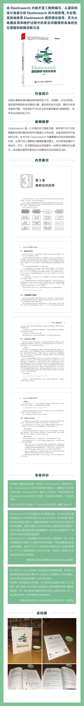

## Elasticsearch源码解析与优化实战

Elasticsearch 是一个开源的全文搜索引擎，很多用户对于大规模集群应用时遇到的各种问题难以分析处理，或者知其然而不知其所以然。本书分析 Elasticsearch 中重要模块及其实现原理和机制，让用户深入理解相关重要配置项意义，应对系统故障时不再迷茫。另外，本书提供实际应用场景中一些常见问题的优化建议，这些建议都是作者经过大规模测试及应用验证过的。

本书介绍了Elasticsearch的系统原理，旨在帮助读者了解其内部原理、设计思想，以及在生产环境中如何正确地部署、优化系统。系统原理分两方面介绍，一方面详细介绍主要流程，例如启动流程、选主流程、恢复流程；另一方面介绍各重要模块的实现，以及模块之间的关系，例如gateway模块、allocation模块等。本书的最后一部分介绍如何优化写入速度、搜索速度等大家关心的实际问题，并提供了一些诊断问题的方法和工具供读者参考。

本书适合对Elasticsearch进行改进的研发人员、平台运维人员，对分布式搜索感兴趣的朋友，以及在使用Elasticsearch过程中遇到问题的人们。

