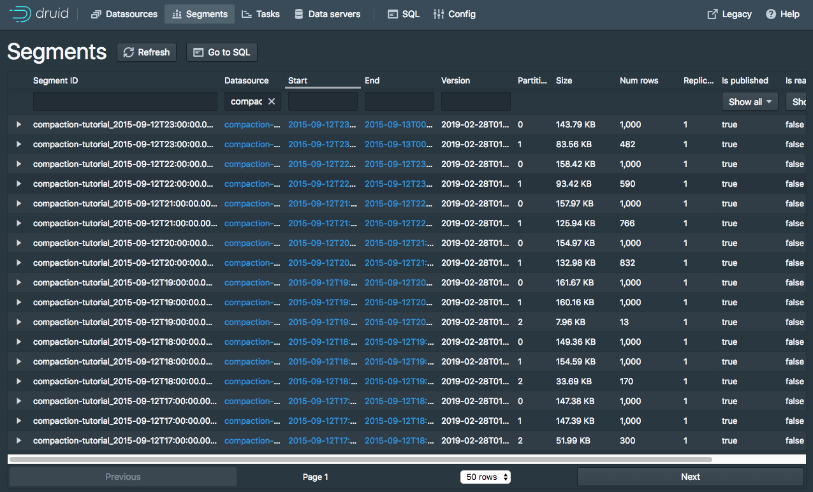
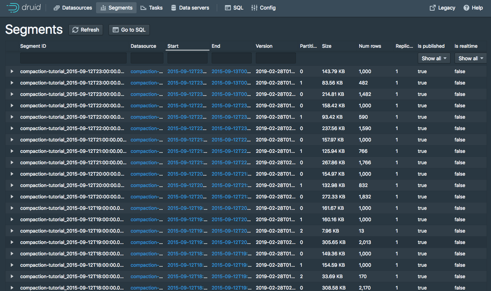

<!-- toc -->

<script async src="https://pagead2.googlesyndication.com/pagead/js/adsbygoogle.js"></script>
<ins class="adsbygoogle"
     style="display:block; text-align:center;"
     data-ad-layout="in-article"
     data-ad-format="fluid"
     data-ad-client="ca-pub-8828078415045620"
     data-ad-slot="7586680510"></ins>
<script>
     (adsbygoogle = window.adsbygoogle || []).push({});
</script>

## 合并段文件

本教程演示如何将现有段合并为较少但更大的段

因为每一个段都有一些内存和处理开销，所以有时减少段的总数是有益的。有关详细信息，请查阅[段大小优化](../Operations/segmentSizeOpt.md)。

本教程我们假设您已经按照[单服务器部署](../GettingStarted/chapter-3.md)中描述下载了Druid，并运行在本地机器上。

完成[加载本地文件](tutorial-batch.md)和[数据查询](./chapter-4.md)两部分内容也是非常有帮助的。

### 加载初始数据

在本教程中，我们将使用wikipedia编辑的示例数据，其中的摄取任务规范将在输入数据中每小时创建1-3个段。

数据摄取规范位于 `quickstart/tutorial/compaction-init-index.json` ,提交这个任务规范将创建一个名称为 `compaction-tutorial` 的数据源：

```json
bin/post-index-task --file quickstart/tutorial/compaction-init-index.json --url http://localhost:8081
```

> ![WARNING] 
> 请注意，摄取规范中的 `maxRowsPerSegment` 设置为1000, 这是为了每小时生成多个段，不建议在生产中使用。默认为5000000，可能需要进行调整以优化您的段文件。

摄取任务完成后，可以到 [http://localhost:8888/unified-console.html#datasources](http://localhost:8888/unified-console.html#datasources) Druid控制台查看新的数据源。


点击 `compaction-tutorial` 数据源中"Fully Available"旁边的 `51 Segments` 链接来查看数据源段的更多信息

该数据源有51个段文件，输入数据每小时1-3个段



对该数据源执行一个 `COUNT(*)` 查询可以看到39244行数据：

```json
dsql> select count(*) from "compaction-tutorial";
┌────────┐
│ EXPR$0 │
├────────┤
│  39244 │
└────────┘
Retrieved 1 row in 1.38s.
```

### 合并数据

现在我们将合并这51个小的段

在 `quickstart/tutorial/compaction-keep-granularity.json` 文件中我们包含了一个本教程数据源的合并任务规范。

```json
{
  "type": "compact",
  "dataSource": "compaction-tutorial",
  "interval": "2015-09-12/2015-09-13",
  "tuningConfig" : {
    "type" : "index_parallel",
    "maxRowsPerSegment" : 5000000,
    "maxRowsInMemory" : 25000
  }
}
```

该任务会合并 `compaction-tutorial` 数据源在 `2015-09-12/2015-09-13` 时间范围内的所有的段

`tuningConfig` 中的参数控制合并后的段文件集合中有多少个段。

在本教程示例中，每小时只创建一个合并段，因为每小时的行数少于5000000 `maxRowsPerSegment`（请注意，行总数为39244）。

现在提交这个任务：
```json
bin/post-index-task --file quickstart/tutorial/compaction-keep-granularity.json --url http://localhost:8081
```

任务运行结束后，刷新 `Segments` 视图

最初的51个段最终将由Coordinator标记为"未使用"，并移除，保留新的合并段。

默认情况下，在Coordinator启动至少15分钟之前，Druid Coordinator不会将段标记为未使用，因此您可以在Druid控制台中同时看到旧段集合和新合并集，共有75个段：




新的合并段比原来的段有一个更新的版本，所以即使两组段都显示在Druid控制台中，查询也只能从新的合并段中读取。

我们再次在 `compaction-tutorial` 数据源执行 `COUNT(*)` 查询可以看到，行数仍然是39244:
```json
dsql> select count(*) from "compaction-tutorial";
┌────────┐
│ EXPR$0 │
├────────┤
│  39244 │
└────────┘
Retrieved 1 row in 1.30s.
```

Coordinator运行至少15分钟后，"Segments"视图应显示有24个分段，每小时一个：


### 用新的段粒度合并数据

合并任务还可以生成不同于输入段粒度的合并段

我们在 `quickstart/tutorial/compaction-day-granularity.json` 文件中包含了一个可以创建 `DAY` 粒度的合并任务摄取规范：

```json
{
  "type": "compact",
  "dataSource": "compaction-tutorial",
  "interval": "2015-09-12/2015-09-13",
  "segmentGranularity": "DAY",
  "tuningConfig" : {
    "type" : "index_parallel",
    "maxRowsPerSegment" : 5000000,
    "maxRowsInMemory" : 25000,
    "forceExtendableShardSpecs" : true
  }
}
```

请注意这个合并任务规范中 `segmentGranularity` 配置项设置为了 `DAY`

现在提交这个任务：
```json
bin/post-index-task --file quickstart/tutorial/compaction-day-granularity.json --url http://localhost:8081
```

Coordinator将旧的输入段标记为未使用需要一段时间，因此您可能会看到总共有25个段的中间状态。最终，只有一个天粒度的段


### 进一步阅读
[任务文档](../DataIngestion/taskrefer.md)

[段优化](../Operations/segmentSizeOpt.md)