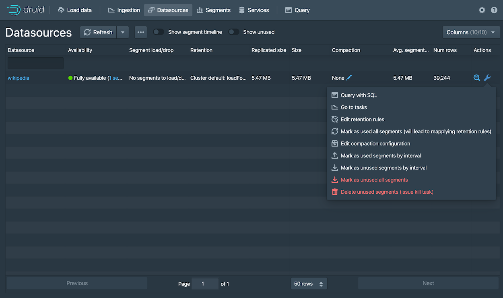

# 快速开始

在本快速开始的内容部分，将向你介绍有关如何开始使用 Apache Druid 和一些相关的基本特性。
当你按照给出的步骤完成操作后，你将能够安装并且运行 Druid 和使用自带的批量数据摄取（ingestion）特性向安装成功的 Druid 实例中导入数据。

!> 当前翻译基于的 Druid 版本为 apache-druid-0.21.1，本页面中的有关下载链接可能会随着版本更新而失效。
请自行根据官方办法的发行进度进行搜索更新和下载。


在开始我们下面的步骤之前，请先阅读 [Druid 概述](../design/index.md) 和 [数据摄取（ingestion）概述](../ingestion/index.md) 中的内容。
因为下面使用的步骤将会参照在前面 2 个 页面中提到过的一些概念和定义。

## 安装要求

你可以按照后续的步骤在一个相对机器性能比较小的计算机上进行安装。例如我们说的笔记本电脑（4 CPU 和 16 GB 的内存）。 

针对不同的机器性能和安装条件，Druid 有一系列的安装配置属性。例如, `micro-quickstart` 配置属性对需要进行 Druid 评估时候的计算机性能进行了配置。
如果你希望对 Druid 的计算性能进行评估或者对计算能力进行调整的话，你可能需要更大和更好性能的计算机并且配置属性（profile）。

Druid 配置属性包括有从 _Nano-Quickstart_ 配置 （1 CPU, 4GB RAM） 到 _X-Large_ 配置（64 CPU, 512GB RAM）。

有关更多的配置信息，请参考 [独立服务器部署](../operations/single-server.md) 页面中的内容
另外，如果你希望对 Druid 进行集群部署的话，请参考  [集群服务器部署](./cluster.md) 页面中的内容来了解更多有关 Druid 集群部署中的配置。

针对运行 Druid 的计算机，你需要完成下面的软件配置：

* Linux， Mac OS X， 或者其他基于 Unix 的操作系统（**不能部署在 Windows 上**）
* Java 8, Update 92 或者后续版本 (8u92+)

> Druid 官方只支持 Java 8 only。对其他主要的 Java 版本进行支持目前还主要是实验性的。

> Druid 通过计算机中的环境变量 `JAVA_HOME` 或者 `DRUID_JAVA_HOME` 来找到安装的 Java 版本。如果你的计算机中安装有多个版本的 Java，那么你可以通过
> 设置环境变量 `DRUID_JAVA_HOME` 来让你安装的 Druid 实例找到相应的 Java 版本。
> 可以运行 Druid 程序中的 `bin/verify-java` 脚本来查看当前运行的 Java 版本。

在将 Druid 安装到生产环境的时候，你需要注意 Druid 实例运行的用户账号是什么。因为 Druid 控制台用户的权限和当前 Druid 实例运行的用户权限是相同的。
例如，如果你使用 Druid 的控制台对文件进行浏览的话，那么操作系统通只显示这个用户能够访问到的文件，或者说有权限进行查看的文件进行显示。
一般来说，我们是不希望 Druid 以 root 用户的权限来运行的。因此针对 Druid 的安装环境，可以考虑针对 Druid 实例，在操作系统中创建一个只供 Druid 运行的用户。

## 第 1 步：安装 Druid

当你确定你的系统已经满足 [安装要求](#安装要求) 的所有内容后，请按照下面的步骤： 

1. 下载
下载地址为： [apache-druid-0.21.1 发布（release）](https://www.apache.org/dyn/closer.cgi?path=/druid/apache-druid-0.21.1/apache-druid-apache-druid-0.21.1-bin.tar.gz).
2. 在你的控制台中，将下载的压缩包进行解压到当前目录，并且进入到解压的目录，或者你将目录移动到你希望部署的的目录中：
   ```bash
   tar -xzf apache-druid-apache-druid-0.21.1-bin.tar.gz
   cd apache-druid-apache-druid-0.21.1
   ```
在解压后的目录中，你会看到 `LICENSE` 和 `NOTICE` 文件，以及一些子目录，在这些子目录中保存有可执行文件，配置文件，示例数据和其他的内容。

在安装包中可能有下面的文件和用途供参考：

* `LICENSE`和`NOTICE` - 文件
* `bin/*` - 启动或停止的脚本
* `conf/*` - 用于单节点部署和集群部署的示例配置
* `extensions/*` - Druid 核心扩展
* `hadoop-dependencies/*` - Druid Hadoop 依赖
* `lib/*` - Druid 核心库和依赖
* `quickstart/*` - 配置文件，样例数据，以及快速入门教材的其他文件

## 第 2 步：启动 Druid 服务

针对一台计算机，你可以使用 `micro-quickstart` 配置来启动所有 Druid 的服务。 

在 apache-druid-apache-druid-0.21.1 包的根目录下，运行下面的命令：

```bash
./bin/start-micro-quickstart
```

上面的命令将会启动 ZooKeeper 和 Druid 服务：

```bash
$ ./bin/start-micro-quickstart
[Fri May  3 11:40:50 2019] Running command[zk], logging to[/apache-druid-apache-druid-0.21.1/var/sv/zk.log]: bin/run-zk conf
[Fri May  3 11:40:50 2019] Running command[coordinator-overlord], logging to[/apache-druid-apache-druid-0.21.1/var/sv/coordinator-overlord.log]: bin/run-druid coordinator-overlord conf/druid/single-server/micro-quickstart
[Fri May  3 11:40:50 2019] Running command[broker], logging to[/apache-druid-apache-druid-0.21.1/var/sv/broker.log]: bin/run-druid broker conf/druid/single-server/micro-quickstart
[Fri May  3 11:40:50 2019] Running command[router], logging to[/apache-druid-apache-druid-0.21.1/var/sv/router.log]: bin/run-druid router conf/druid/single-server/micro-quickstart
[Fri May  3 11:40:50 2019] Running command[historical], logging to[/apache-druid-apache-druid-0.21.1/var/sv/historical.log]: bin/run-druid historical conf/druid/single-server/micro-quickstart
[Fri May  3 11:40:50 2019] Running command[middleManager], logging to[/apache-druid-apache-druid-0.21.1/var/sv/middleManager.log]: bin/run-druid middleManager conf/druid/single-server/micro-quickstart
```

如上面输出的内容表示的，集群元数据存储（cluster metadata store） 和服务段（segments for the service）都会保存在 Druid 根目录下面的 `var` 目录中。
这个 Druid 的根目录就是 apache-druid-apache-druid-0.21.1，换句话说就是你最开始解压并且既然怒的目录。

所有的服务将会把日志写入到 `var/sv` 目录中，同时也会将脚本的控制台输出按照上面的格式进行输出。

在任何时候，如果你删除 `var` 目录的话，那你按照的 Druid 实例将会返回到原始初始化后的状态。

例如，如果你在完成了一个 Druid 的展示或者数据处理后希望开始一个全新完整的实例，那么你可以直接删除 `var` 目录就可以了。 

如果你希望推出当前 Druid 的实例的话，在终端中使用快捷键 CTRL-C 来退出当前运行的模式。这个命令将会退出 `bin/start-micro-quickstart` 脚本，并且终止所有 Druid 的进程。


## 第 3 步：访问 Druid 控制台 

当 Druid 的进程完全启动后，打开  [Druid 控制台（console）](../operations/druid-console.md) 。访问的地址为： [http://localhost:8888](http://localhost:8888) 默认的使用端口为 8888。 


整个过程可能还需要耗费几秒钟的时间等待所有的 Druid 服务启动，包括 [Druid router](../design/router.md) 这个服务。

在 Druid 中 router 服务是提供控制台访问的的服务。

如果在所有 Druid 服务器都完全启动之前尝试访问控制台的话，那么很有可能会得到浏览器的房屋错误提示信息，请等待一些时间再尝试访问。


## 第 4 步：导入数据
Druid 是通过读取和存储有关导入数据的摘要（schema）来完成导入的。
你可以完全手写一个数据导入参数摘要，或者使用 _data loader_ 来替你完成对数据摘要的定义。在这里我们通过使用 Druid 的原生批量数据导入来进行演示操作。

在 Druid 的发行包中还打包了一个可以供测试的样例数据。这个样例数据位于在 Druid 根目录下面的 `quickstart/tutorial/wikiticker-2015-09-12-sampled.json.gz` 路径下。
这个文件包含有给定日期（2015年9月12日）发生在 Wikipedia 上的所有页面编辑事件。

1. 从 Druid 的控制台顶部，单击 **载入数据（Load data）**  ()。

2. 然后选择 **从磁盘载入（Local disk）** ，然后再单击选择 **连接数据（Connect data）**。

   

3. 输入下面的指定参数：
   - **基础目录（Base directory）**: `quickstart/tutorial/`

   - **文件过滤器（File filter）**: `wikiticker-2015-09-12-sampled.json.gz` 

   
   在给定的 UI 界面中，输入基础的目录名称和 [通配文件过滤器](https://commons.apache.org/proper/commons-io/apidocs/org/apache/commons/io/filefilter/WildcardFileFilter.html) , 这种配置方式是为了能够让你在一次导入的过程中选择多个文件。

4. 单击 **应用（Apply）**
   数据载入器将会显示原始数据（raw data），在这里能够为你对数据检查提供一个机会，你可以通过数据载入器查看给出的数据结构是不是自己想要的数据结构。

   

   请注意到当前我们对数据进行导入的步骤，在现在这个过程中的步骤为 **Connect**，这个将会显示在控制台的顶部，具体的菜单栏如下图显示的样式。
   
   
   
   你可以在当前的界面中对需要进行的步骤进行调整，你可以向前移动步骤，你也可以向后移动步骤。

5. 单击 **下一步：处理数据（Parse data）**.
   数据载入工具将会根据载入的数据格式尝试自动确定需要使用的数据处理器。在现在的这个案例中，数据载入工具将会需要载入的数据认定为 `json` 格式。
   认定的结果显示在页面的 **Input format** 字段内。 

   

   你也可以对这个格式进行调整，在 **Input format** 的选项中选择数据应该使用的格式，这样将会帮助 Druid 调用不同的数据格式处理器。

6. 当 JSON 数据处理器被选择后，单击 **下一步：处理日期（Parse time）**。这个 **Parse time** 的设置就是让你能够查看和调整数据中针对时间的主键设置。

   

   Druid 要求所有数据必须有一个 timestamp 的主键字段（这个主键字段被定义和存储在 `__time`）中。
   如果你需要导入的数据没有时间字段的话，那么请选择  `Constant value`。在我们现在的示例中，数据载入器确定 `time` 字段是唯一可以被用来作为数据时间字段的数据。

7. 单击 **下一步：转换（Transform）**, **下一步：过滤器（Filter）**，然后再  **下一步：配置摘要（schema）**，跳过一些步骤
   因为针对本教程来说，你并不需要对导入时间进行换行，所以你不需要调整 转换（Transform） 和 过滤器（Filter） 的配置。

8. 配置摘要（schema） 是你对 [dimensions](../ingestion/index.md#dimensions) 和 [metrics](../ingestion/index.md#metrics) 在导入数据的时候配置的地方。
   这个界面显示的是当我们对数据在 Druid 中进行导入的时候，数据是如何在 Druid 中进行存储和表现的。

   因为我们提交的数据集非常小，因此我们可以关闭 [回滚（rollup）](../ingestion/index.md#rollup) ，**Rollup** 的开关将不会在这个时候显示来供你选择。

   


10. 单击 **下一步：分区（Partition）** 来配置数据是如何在段（segments）中进行拆分的，选择  `DAY` 做为 **段粒度（Segment granularity）**

    

    因为当前的数据集是一个非常小的数据库，我们可以只使用单一段（segment）就可以了，简单来说就是使用 `DAY` 来作为 段粒度（Segment granularity）。

11. 单击 **下一步：调整（Tune）** 和 **下一步：发布（Publish）**

12. 在发布（Publish）的设置中，你需要在 Druid 的数据源的名称，我们可以选择默认的名字，这个名字将数据源的名称从 `wikiticker-2015-09-12-sampled` 修改为 `wikipedia`。 

    


13. 单击 **下一步：编辑特性（ Edit spec）** 来在数据导入器中查看需要导入的数据特性。 

    

    你可以随意的通过页面中的导航返回到前面的页面中对配置进行调整。简单来说你可以对特性目录进行编辑，来查看编辑后的配置是如何对前面的步骤产生影响的。

    > 针对更多有关在 Druid 中载入导入数据配置的方法，请参考页面： [教程：载入一个文件](tutorial-batch.md). 

14. 当你对所有的配置都满意并且觉得没有问题的时候，单击 **提交（Submit）**.

    针对我们需要向 Druid 中导入 wikipedia 数据的任务将会显示在 导入视图（Ingestion view）中。 

    

    整个导入的过程可能需要耗费 1 到 2 分钟。当导入完成后，任务的状态将会显示为 "SUCCESS"，这表示的是导入的过程已经完成，任务已经结束了。
    需要注意的是，导入过程的视图是自动刷新的，所以你不需要通过刷新浏览器来刷新页面后来查看状态的改变。

    一个成功的任务表达的意思是：一个或者多个段（segments）被创建，同时从数据服务器上获取了数据。

## 第 5 步：查询数据

现在你就可以在 Druid 的控制台中的 datasource 标签页查看数据，同时你可以尝试使用下面的查询： 

1. 从控制台的顶部单击 **数据源（Datasources）**  
  
   如果 wikipedia 的数据源没有显示的话，请等待一会让导入的段完成数据载入。一个数据源如果在 **Availability** 列中被定义显示为 "Fully available"， 
   那么这个数据源就可以进行查询了。

2. 但一个数据源显示为可用的时候，针对这个数据源打开 Actions () 菜单，然后选择  **使用 SQL 进行查询（Query with SQL）**。

   

   > 请注意，你还可以对数据源进行一些其他的操作，包括有配置，保留时间规则，压缩等。

3. 运行下面的查询语句，`SELECT * FROM "wikipedia"` 来查看查询结果。

   

祝贺你！当你完成上面的步骤，并且能够从查询窗口中看到查询结果的话，那么你就完成了对 Druid 进行快速部署并且导入数据的全过程。
请参考下面页面中的内容来对 Druid 进行后续步骤的操作。


## 下一步

在完成上面步骤中的快速导航后，请查看 [query 教程](./tutorial-query.md) 页面中的内容来了解如何在 Druid 的控制台中使用查询语句。

还有，如果你还希望从其他的数据导入方式中导入数据到 Druid，请参考下面的页面链接： 

- [从 Apache Kafka 中加载流式数据](./tutorial-kafka.md) – 如何从 Kafka 的主题中加载流式数据。
- [使用 Apache Hadoop 载入一个文件](./tutorial-batch-hadoop.md) – 如何使用远程 Hadoop 集群执行批处理文件加载
- [编写一个你自己的数据导入规范](./tutorial-ingestion-spec.md) – 如何编写新的数据导入规范并使用它来加载数据


请注意，当你停止了 Druid 的服务后，可以通过删除 Druid 根目录下的 `var` 目录，并且再次运行 `bin/start-micro-quickstart` 脚本来让 Druid 启动一个完全新的实例 。
如果你还希望导入相同的 Wikipedia 数据，并且使用不同的数据导入方式的话，你需要完成上面的删除步骤，然后再次启动 Druid，这是因为你可能会使用相同的数据导入。
