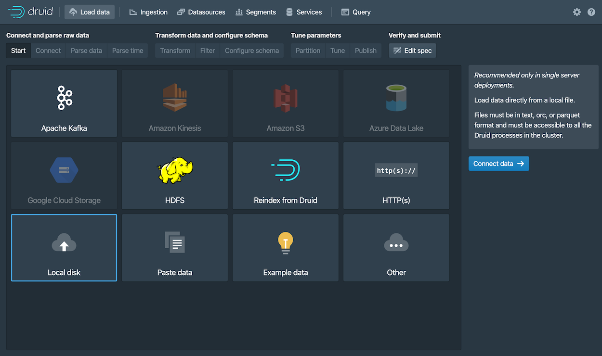
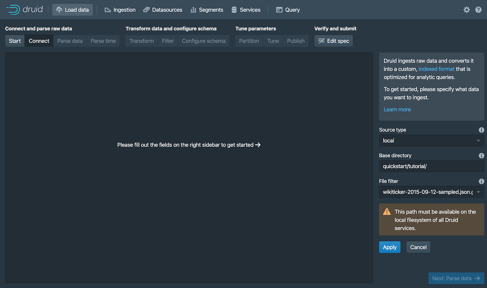
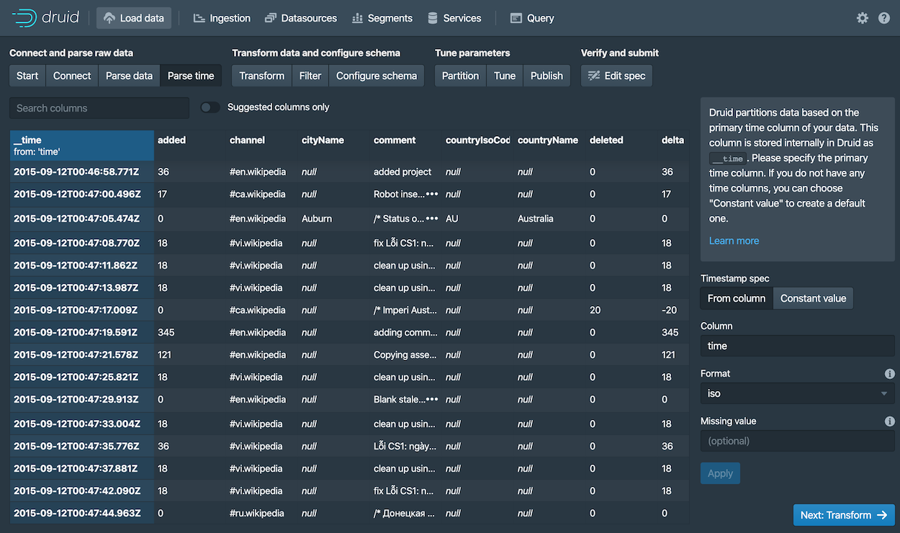

# 快速开始

在本快速开始的内容部分，将向你介绍有关如何开始使用 Apache Druid 和一些相关的基本特性。
当你按照给出的步骤完成操作后，你将能够安装并且运行 Druid 和使用自带的批量数据摄取（ingestion）特性向安装成功的 Druid 实例中导入数据。

在开始我们下面的步骤之前，请先阅读 [Druid 概述](../design/index.md) 和 [数据摄取（ingestion）概述](../ingestion/index.md) 中的内容。
因为下面使用的步骤将会参照在前面 2 个 页面中提到过的一些概念和定义。

## 安装要求

你可以按照后续的步骤在一个相对机器性能比较小的计算机上进行安装。例如我们说的笔记本电脑（4 CPU 和 16 GB 的内存）。 

针对不同的机器性能和安装条件，Druid 有一系列的安装配置属性。例如, `micro-quickstart` 配置属性对需要进行 Druid 评估时候的计算机性能进行了配置。
如果你希望对 Druid 的计算性能进行评估或者对计算能力进行调整的话，你可能需要更大和更好性能的计算机并且配置属性（profile）。

Druid 配置属性包括有从 _Nano-Quickstart_ 配置 （1 CPU, 4GB RAM） 到 _X-Large_ 配置（64 CPU, 512GB RAM）。

有关更多的配置信息，请参考 [独立服务器部署](../operations/single-server.md) 页面中的内容
另外，如果你希望对 Druid 进行集群部署的话，请参考  [集群服务器部署](./cluster.md) 页面中的内容来了解更多有关 Druid 集群部署中的配置。

针对运行 Druid 的计算机，你需要完成下面的软件配置：

* Linux， Mac OS X， 或者其他基于 Unix 的操作系统（**不能部署在 Windows 上**）
* Java 8, Update 92 或者后续版本 (8u92+)

> Druid 官方只支持 Java 8 only。对其他主要的 Java 版本进行支持目前还主要是实验性的。

> Druid 通过计算机中的环境变量 `JAVA_HOME` 或者 `DRUID_JAVA_HOME` 来找到安装的 Java 版本。如果你的计算机中安装有多个版本的 Java，那么你可以通过
> 设置环境变量 `DRUID_JAVA_HOME` 来让你安装的 Druid 实例找到相应的 Java 版本。
> 可以运行 Druid 程序中的 `bin/verify-java` 脚本来查看当前运行的 Java 版本。

在将 Druid 安装到生产环境的时候，你需要注意 Druid 实例运行的用户账号是什么。因为 Druid 控制台用户的权限和当前 Druid 实例运行的用户权限是相同的。
例如，如果你使用 Druid 的控制台对文件进行浏览的话，那么操作系统通只显示这个用户能够访问到的文件，或者说有权限进行查看的文件进行显示。
一般来说，我们是不希望 Druid 以 root 用户的权限来运行的。因此针对 Druid 的安装环境，可以考虑针对 Druid 实例，在操作系统中创建一个只供 Druid 运行的用户。


## 第 1 步：安装 Druid

After confirming the [requirements](#requirements), follow these steps: 

1. Download
the [{{DRUIDVERSION}} release](https://www.apache.org/dyn/closer.cgi?path=/druid/{{DRUIDVERSION}}/apache-druid-{{DRUIDVERSION}}-bin.tar.gz).
2. In your terminal, extract Druid and change directories to the distribution directory:

   ```bash
   tar -xzf apache-druid-{{DRUIDVERSION}}-bin.tar.gz
   cd apache-druid-{{DRUIDVERSION}}
   ```
In the directory, you'll find `LICENSE` and `NOTICE` files and subdirectories for executable files, configuration files, sample data and more.

## 第 2 步：启动 Druid 服务

Start up Druid services using the `micro-quickstart` single-machine configuration. 

From the apache-druid-{{DRUIDVERSION}} package root, run the following command:

```bash
./bin/start-micro-quickstart
```

This brings up instances of ZooKeeper and the Druid services:

```bash
$ ./bin/start-micro-quickstart
[Fri May  3 11:40:50 2019] Running command[zk], logging to[/apache-druid-{{DRUIDVERSION}}/var/sv/zk.log]: bin/run-zk conf
[Fri May  3 11:40:50 2019] Running command[coordinator-overlord], logging to[/apache-druid-{{DRUIDVERSION}}/var/sv/coordinator-overlord.log]: bin/run-druid coordinator-overlord conf/druid/single-server/micro-quickstart
[Fri May  3 11:40:50 2019] Running command[broker], logging to[/apache-druid-{{DRUIDVERSION}}/var/sv/broker.log]: bin/run-druid broker conf/druid/single-server/micro-quickstart
[Fri May  3 11:40:50 2019] Running command[router], logging to[/apache-druid-{{DRUIDVERSION}}/var/sv/router.log]: bin/run-druid router conf/druid/single-server/micro-quickstart
[Fri May  3 11:40:50 2019] Running command[historical], logging to[/apache-druid-{{DRUIDVERSION}}/var/sv/historical.log]: bin/run-druid historical conf/druid/single-server/micro-quickstart
[Fri May  3 11:40:50 2019] Running command[middleManager], logging to[/apache-druid-{{DRUIDVERSION}}/var/sv/middleManager.log]: bin/run-druid middleManager conf/druid/single-server/micro-quickstart
```

All persistent state, such as the cluster metadata store and segments for the services, are kept in the `var` directory under 
the Druid root directory, apache-druid-{{DRUIDVERSION}}. Each service writes to a log file under `var/sv`, as noted in the startup script output above.

At any time, you can revert Druid to its original, post-installation state by deleting the entire `var` directory. You may
want to do this, for example, between Druid tutorials or after experimentation, to start with a fresh instance. 

To stop Druid at any time, use CTRL-C in the terminal. This exits the `bin/start-micro-quickstart` script and 
terminates all Druid processes. 


## 第 3 步：访问 Druid 控制台 

After the Druid services finish startup, open the [Druid console](../operations/druid-console.md) at [http://localhost:8888](http://localhost:8888). 


It may take a few seconds for all Druid services to finish starting, including the [Druid router](../design/router.md), which serves the console. If you attempt to open the Druid console before startup is complete, you may see errors in the browser. Wait a few moments and try again. 


## 第 4 步：导入数据


Ingestion specs define the schema of the data Druid reads and stores. You can write ingestion specs by hand or using the _data loader_, 
as we'll do here to perform batch file loading with Druid's native batch ingestion.

The Druid distribution bundles sample data we can use. The sample data located in `quickstart/tutorial/wikiticker-2015-09-12-sampled.json.gz` 
in the Druid root directory represents Wikipedia page edits for a given day. 

1. Click **Load data** from the Druid console header ().

2. Select the **Local disk** tile and then click **Connect data**.

   

3. Enter the following values: 

   - **Base directory**: `quickstart/tutorial/`

   - **File filter**: `wikiticker-2015-09-12-sampled.json.gz` 

   

   Entering the base directory and [wildcard file filter](https://commons.apache.org/proper/commons-io/apidocs/org/apache/commons/io/filefilter/WildcardFileFilter.html) separately, as afforded by the UI, allows you to specify multiple files for ingestion at once.

4. Click **Apply**. 

   The data loader displays the raw data, giving you a chance to verify that the data 
   appears as expected. 

   

   Notice that your position in the sequence of steps to load data, **Connect** in our case, appears at the top of the console, as shown below. 
   You can click other steps to move forward or backward in the sequence at any time.
   
     
   

5. Click **Next: Parse data**. 

   The data loader tries to determine the parser appropriate for the data format automatically. In this case 
   it identifies the data format as `json`, as shown in the **Input format** field at the bottom right.

   

   Feel free to select other **Input format** options to get a sense of their configuration settings 
   and how Druid parses other types of data.  

6. With the JSON parser selected, click **Next: Parse time**. The **Parse time** settings are where you view and adjust the 
   primary timestamp column for the data.

   

   Druid requires data to have a primary timestamp column (internally stored in a column called `__time`).
   If you do not have a timestamp in your data, select `Constant value`. In our example, the data loader 
   determines that the `time` column is the only candidate that can be used as the primary time column.

7. Click **Next: Transform**, **Next: Filter**, and then **Next: Configure schema**, skipping a few steps.

   You do not need to adjust transformation or filtering settings, as applying ingestion time transforms and 
   filters are out of scope for this tutorial.

8. The Configure schema settings are where you configure what [dimensions](../ingestion/index.md#dimensions) 
   and [metrics](../ingestion/index.md#metrics) are ingested. The outcome of this configuration represents exactly how the 
   data will appear in Druid after ingestion. 

   Since our dataset is very small, you can turn off [rollup](../ingestion/index.md#rollup) 
   by unsetting the **Rollup** switch and confirming the change when prompted.

   


10. Click **Next: Partition** to configure how the data will be split into segments. In this case, choose `DAY` as 
    the **Segment granularity**. 

    

    Since this is a small dataset, we can have just a single segment, which is what selecting `DAY` as the 
    segment granularity gives us. 

11. Click **Next: Tune** and **Next: Publish**.

12. The Publish settings are where you specify the datasource name in Druid. Let's change the default name from 
`wikiticker-2015-09-12-sampled` to `wikipedia`. 

    


13. Click **Next: Edit spec** to review the ingestion spec we've constructed with the data loader. 

    

    Feel free to go back and change settings from previous steps to see how doing so updates the spec.
    Similarly, you can edit the spec directly and see it reflected in the previous steps. 

    > For other ways to load ingestion specs in Druid, see [Tutorial: Loading a file](./tutorial-batch.md). 

14. Once you are satisfied with the spec, click **Submit**.

    The new task for our wikipedia datasource now appears in the Ingestion view. 

    

    The task may take a minute or two to complete. When done, the task status should be "SUCCESS", with
    the duration of the task indicated. Note that the view is set to automatically 
    refresh, so you do not need to refresh the browser to see the status change.

    A successful task means that one or more segments have been built and are now picked up by our data servers.


## 第 5 步：查询数据

You can now see the data as a datasource in the console and try out a query, as follows: 

1. Click **Datasources** from the console header. 
  
   If the wikipedia datasource doesn't appear, wait a few moments for the segment to finish loading. A datasource is 
   queryable once it is shown to be "Fully available" in the **Availability** column. 

2. When the datasource is available, open the Actions menu () for that 
   datasource and choose **Query with SQL**.

   

   > Notice the other actions you can perform for a datasource, including configuring retention rules, compaction, and more. 

3. Run the prepopulated query, `SELECT * FROM "wikipedia"` to see the results.

   

Congratulations! You've gone from downloading Druid to querying data in just one quickstart. See the following
section for what to do next. 


## 下一步

After finishing the quickstart, check out the [query tutorial](../tutorials/tutorial-query.md) to further explore 
Query features in the Druid console. 

Alternatively, learn about other ways to ingest data in one of these tutorials: 

- [Loading stream data from Apache Kafka](./tutorial-kafka.md) – How to load streaming data from a Kafka topic.
- [Loading a file using Apache Hadoop](./tutorial-batch-hadoop.md) – How to perform a batch file load, using a remote Hadoop cluster.
- [Writing your own ingestion spec](./tutorial-ingestion-spec.md) – How to write a new ingestion spec and use it to load data.


Remember that after stopping Druid services, you can start clean next time by deleting the `var` directory from the Druid root directory and 
running the `bin/start-micro-quickstart` script again. You will likely want to do this before taking other data ingestion tutorials, 
since in them you will create the same wikipedia datasource. 


##### 硬件

Druid安装包提供了几个[单服务器配置](./chapter-3.md)的示例，以及使用这些配置启动Druid进程的脚本。

如果您正在使用便携式等小型计算机上运行服务，则配置为4CPU/16GB RAM环境的`micro-quickstart`配置是一个不错的选择。

如果您打算在本教程之外使用单机部署进行进一步试验评估，则建议使用比`micro-quickstart`更大的配置。

#### 入门开始

[下载](https://www.apache.org/dyn/closer.cgi?path=/druid/0.17.0/apache-druid-0.17.0-bin.tar.gz)Druid最新0.17.0release安装包

在终端中运行以下命令来提取Druid

```json
tar -xzf apache-druid-0.17.0-bin.tar.gz
cd apache-druid-0.17.0
```

在安装包中有以下文件：

* `LICENSE`和`NOTICE`文件
* `bin/*` - 启停等脚本
* `conf/*` - 用于单节点部署和集群部署的示例配置
* `extensions/*` - Druid核心扩展
* `hadoop-dependencies/*` - Druid Hadoop依赖
* `lib/*` - Druid核心库和依赖
* `quickstart/*` - 配置文件，样例数据，以及快速入门教材的其他文件

#### 启动服务

以下命令假定您使用的是`micro-quickstart`单机配置，如果使用的是其他配置，在`bin`目录下有每一种配置对应的脚本，如`bin/start-single-server-small`

在`apache-druid-0.17.0`安装包的根目录下执行命令：

```json
./bin/start-micro-quickstart
```
然后将在本地计算机上启动Zookeeper和Druid服务实例，例如：

```json
$ ./bin/start-micro-quickstart
[Fri May  3 11:40:50 2019] Running command[zk], logging to[/apache-druid-0.17.0/var/sv/zk.log]: bin/run-zk conf
[Fri May  3 11:40:50 2019] Running command[coordinator-overlord], logging to[/apache-druid-0.17.0/var/sv/coordinator-overlord.log]: bin/run-druid coordinator-overlord conf/druid/single-server/micro-quickstart
[Fri May  3 11:40:50 2019] Running command[broker], logging to[/apache-druid-0.17.0/var/sv/broker.log]: bin/run-druid broker conf/druid/single-server/micro-quickstart
[Fri May  3 11:40:50 2019] Running command[router], logging to[/apache-druid-0.17.0/var/sv/router.log]: bin/run-druid router conf/druid/single-server/micro-quickstart
[Fri May  3 11:40:50 2019] Running command[historical], logging to[/apache-druid-0.17.0/var/sv/historical.log]: bin/run-druid historical conf/druid/single-server/micro-quickstart
[Fri May  3 11:40:50 2019] Running command[middleManager], logging to[/apache-druid-0.17.0/var/sv/middleManager.log]: bin/run-druid middleManager conf/druid/single-server/micro-quickstart
```

所有的状态（例如集群元数据存储和服务的segment文件）将保留在`apache-druid-0.17.0`软件包根目录下的`var`目录中, 服务的日志位于 `var/sv`。

稍后，如果您想停止服务，请按`CTRL-C`退出`bin/start-micro-quickstart`脚本，该脚本将终止Druid进程。

集群启动后，可以访问[http://localhost:8888](http://localhost:8888)来Druid控制台，控制台由Druid Router进程启动。


所有Druid进程完全启动需要花费几秒钟。 如果在启动服务后立即打开控制台，则可能会看到一些可以安全忽略的错误。

#### 加载数据
##### 教程使用的数据集

对于以下数据加载教程，我们提供了一个示例数据文件，其中包含2015年9月12日发生的Wikipedia页面编辑事件。

该样本数据位于Druid包根目录的`quickstart/tutorial/wikiticker-2015-09-12-sampled.json.gz`中,页面编辑事件作为JSON对象存储在文本文件中。

示例数据包含以下几列，示例事件如下所示：

* added
* channel
* cityName
* comment
* countryIsoCode
* countryName
* deleted
* delta
* isAnonymous
* isMinor
* isNew
* isRobot
* isUnpatrolled
* metroCode
* namespace
* page
* regionIsoCode
* regionName
* user

```json
{
  "timestamp":"2015-09-12T20:03:45.018Z",
  "channel":"#en.wikipedia",
  "namespace":"Main",
  "page":"Spider-Man's powers and equipment",
  "user":"foobar",
  "comment":"/* Artificial web-shooters */",
  "cityName":"New York",
  "regionName":"New York",
  "regionIsoCode":"NY",
  "countryName":"United States",
  "countryIsoCode":"US",
  "isAnonymous":false,
  "isNew":false,
  "isMinor":false,
  "isRobot":false,
  "isUnpatrolled":false,
  "added":99,
  "delta":99,
  "deleted":0,
}
```

##### 数据加载

以下教程演示了将数据加载到Druid的各种方法，包括批处理和流处理用例。 所有教程均假定您使用的是上面提到的`micro-quickstart`单机配置。

* [加载本地文件](../Tutorials/chapter-1.md) - 本教程演示了如何使用Druid的本地批处理摄取来执行批文件加载
* [从Kafka加载流数据](../Tutorials/chapter-2.md) - 本教程演示了如何从Kafka主题加载流数据
* [从Hadoop加载数据](../Tutorials/chapter-3.md) - 本教程演示了如何使用远程Hadoop集群执行批处理文件加载
* [编写一个自己的数据摄取规范](../Tutorials/chapter-10.md) - 本教程演示了如何编写新的数据摄取规范并使用它来加载数据

##### 重置集群状态

如果要在清理服务后重新启动，请删除`var`目录，然后再次运行`bin/start-micro-quickstart`脚本。

一旦每个服务都启动，您就可以加载数据了。

##### 重置Kafka

如果您完成了[教程：从Kafka加载流数据](../Tutorials/chapter-2.md)并希望重置集群状态，则还应该清除所有Kafka状态。

在停止ZooKeeper和Druid服务之前，使用`CTRL-C`关闭`Kafka Broker`，然后删除`/tmp/kafka-logs`中的Kafka日志目录：

```
rm -rf /tmp/kafka-logs
```
