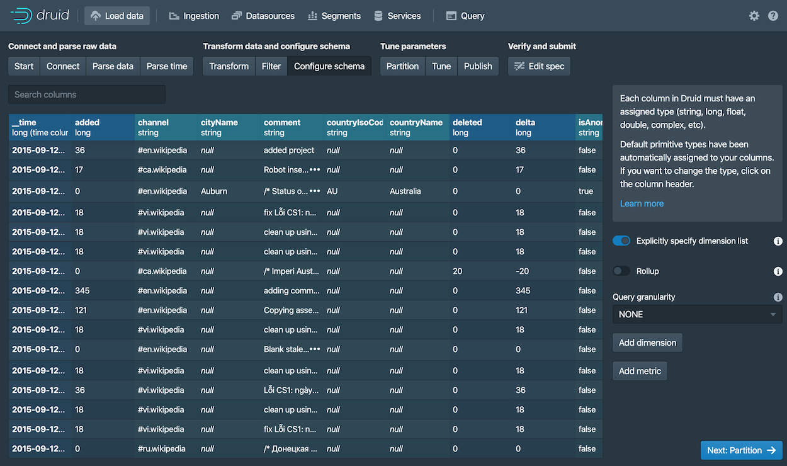
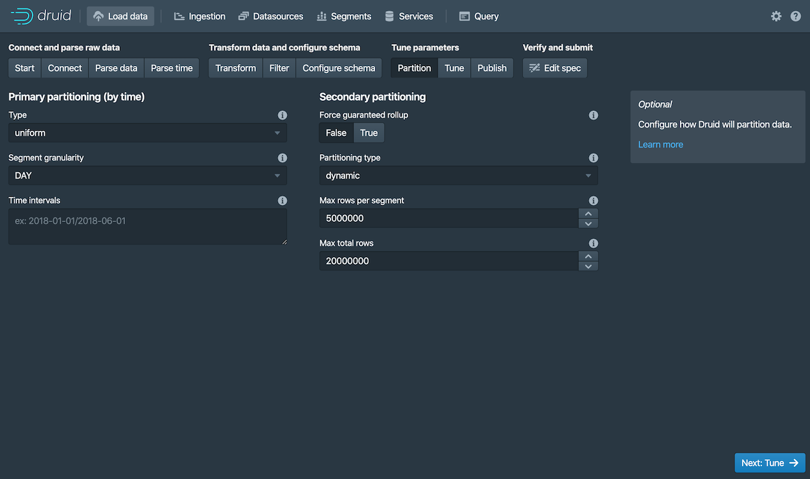
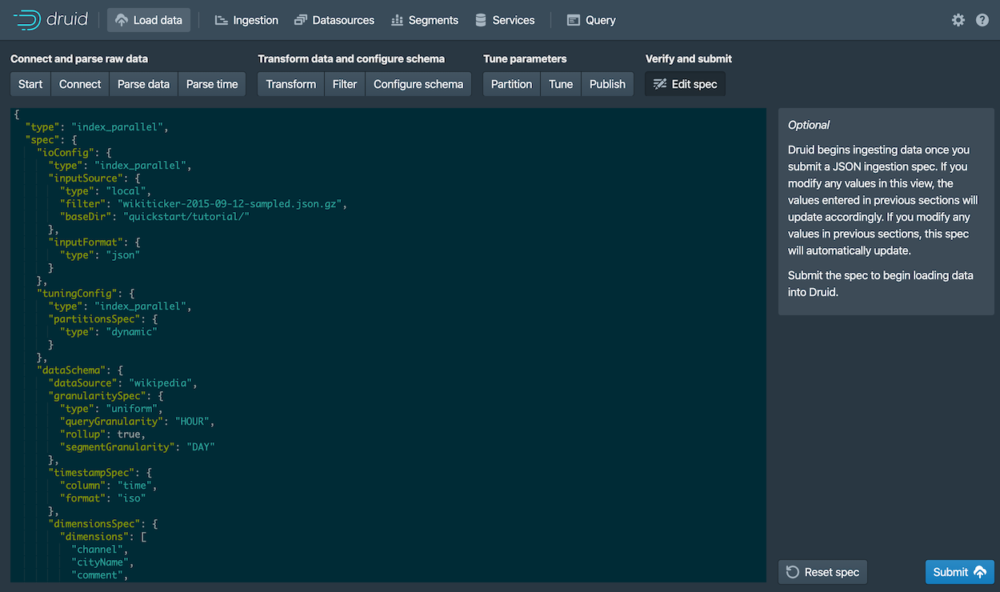
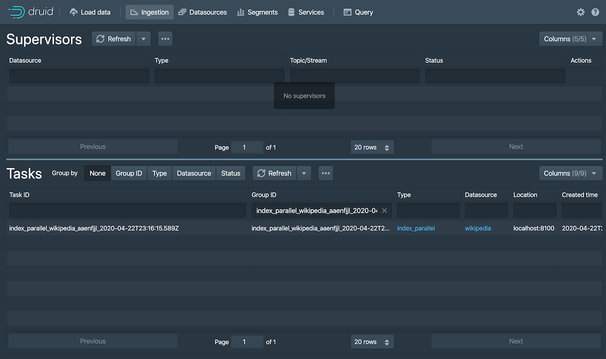

# 快速开始

在本快速开始的内容部分，将向你介绍有关如何开始使用 Apache Druid 和一些相关的基本特性。
当你按照给出的步骤完成操作后，你将能够安装并且运行 Druid 和使用自带的批量数据摄取（ingestion）特性向安装成功的 Druid 实例中导入数据。

!> 当前翻译基于的 Druid 版本为 apache-druid-0.21.1，本页面中的有关下载链接可能会随着版本更新而失效。
请自行根据官方办法的发行进度进行搜索更新和下载。


在开始我们下面的步骤之前，请先阅读 [Druid 概述](../design/index.md) 和 [数据摄取（ingestion）概述](../ingestion/index.md) 中的内容。
因为下面使用的步骤将会参照在前面 2 个 页面中提到过的一些概念和定义。

## 安装要求

你可以按照后续的步骤在一个相对机器性能比较小的计算机上进行安装。例如我们说的笔记本电脑（4 CPU 和 16 GB 的内存）。 

针对不同的机器性能和安装条件，Druid 有一系列的安装配置属性。例如, `micro-quickstart` 配置属性对需要进行 Druid 评估时候的计算机性能进行了配置。
如果你希望对 Druid 的计算性能进行评估或者对计算能力进行调整的话，你可能需要更大和更好性能的计算机并且配置属性（profile）。

Druid 配置属性包括有从 _Nano-Quickstart_ 配置 （1 CPU, 4GB RAM） 到 _X-Large_ 配置（64 CPU, 512GB RAM）。

有关更多的配置信息，请参考 [独立服务器部署](../operations/single-server.md) 页面中的内容
另外，如果你希望对 Druid 进行集群部署的话，请参考  [集群服务器部署](./cluster.md) 页面中的内容来了解更多有关 Druid 集群部署中的配置。

针对运行 Druid 的计算机，你需要完成下面的软件配置：

* Linux， Mac OS X， 或者其他基于 Unix 的操作系统（**不能部署在 Windows 上**）
* Java 8, Update 92 或者后续版本 (8u92+)

> Druid 官方只支持 Java 8 only。对其他主要的 Java 版本进行支持目前还主要是实验性的。

> Druid 通过计算机中的环境变量 `JAVA_HOME` 或者 `DRUID_JAVA_HOME` 来找到安装的 Java 版本。如果你的计算机中安装有多个版本的 Java，那么你可以通过
> 设置环境变量 `DRUID_JAVA_HOME` 来让你安装的 Druid 实例找到相应的 Java 版本。
> 可以运行 Druid 程序中的 `bin/verify-java` 脚本来查看当前运行的 Java 版本。

在将 Druid 安装到生产环境的时候，你需要注意 Druid 实例运行的用户账号是什么。因为 Druid 控制台用户的权限和当前 Druid 实例运行的用户权限是相同的。
例如，如果你使用 Druid 的控制台对文件进行浏览的话，那么操作系统通只显示这个用户能够访问到的文件，或者说有权限进行查看的文件进行显示。
一般来说，我们是不希望 Druid 以 root 用户的权限来运行的。因此针对 Druid 的安装环境，可以考虑针对 Druid 实例，在操作系统中创建一个只供 Druid 运行的用户。

## 第 1 步：安装 Druid

当你确定你的系统已经满足 [安装要求](#安装要求) 的所有内容后，请按照下面的步骤： 

1. 下载
下载地址为： [apache-druid-0.21.1 发布（release）](https://www.apache.org/dyn/closer.cgi?path=/druid/apache-druid-0.21.1/apache-druid-apache-druid-0.21.1-bin.tar.gz).
2. 在你的控制台中，将下载的压缩包进行解压到当前目录，并且进入到解压的目录，或者你将目录移动到你希望部署的的目录中：
   ```bash
   tar -xzf apache-druid-apache-druid-0.21.1-bin.tar.gz
   cd apache-druid-apache-druid-0.21.1
   ```
在解压后的目录中，你会看到 `LICENSE` 和 `NOTICE` 文件，以及一些子目录，在这些子目录中保存有可执行文件，配置文件，示例数据和其他的内容。

在安装包中可能有下面的文件和用途供参考：

* `LICENSE`和`NOTICE` - 文件
* `bin/*` - 启动或停止的脚本
* `conf/*` - 用于单节点部署和集群部署的示例配置
* `extensions/*` - Druid 核心扩展
* `hadoop-dependencies/*` - Druid Hadoop 依赖
* `lib/*` - Druid 核心库和依赖
* `quickstart/*` - 配置文件，样例数据，以及快速入门教材的其他文件

## 第 2 步：启动 Druid 服务

针对一台计算机，你可以使用 `micro-quickstart` 配置来启动所有 Druid 的服务。 

在 apache-druid-apache-druid-0.21.1 包的根目录下，运行下面的命令：

```bash
./bin/start-micro-quickstart
```

上面的命令将会启动 ZooKeeper 和 Druid 服务：

```bash
$ ./bin/start-micro-quickstart
[Fri May  3 11:40:50 2019] Running command[zk], logging to[/apache-druid-apache-druid-0.21.1/var/sv/zk.log]: bin/run-zk conf
[Fri May  3 11:40:50 2019] Running command[coordinator-overlord], logging to[/apache-druid-apache-druid-0.21.1/var/sv/coordinator-overlord.log]: bin/run-druid coordinator-overlord conf/druid/single-server/micro-quickstart
[Fri May  3 11:40:50 2019] Running command[broker], logging to[/apache-druid-apache-druid-0.21.1/var/sv/broker.log]: bin/run-druid broker conf/druid/single-server/micro-quickstart
[Fri May  3 11:40:50 2019] Running command[router], logging to[/apache-druid-apache-druid-0.21.1/var/sv/router.log]: bin/run-druid router conf/druid/single-server/micro-quickstart
[Fri May  3 11:40:50 2019] Running command[historical], logging to[/apache-druid-apache-druid-0.21.1/var/sv/historical.log]: bin/run-druid historical conf/druid/single-server/micro-quickstart
[Fri May  3 11:40:50 2019] Running command[middleManager], logging to[/apache-druid-apache-druid-0.21.1/var/sv/middleManager.log]: bin/run-druid middleManager conf/druid/single-server/micro-quickstart
```

如上面输出的内容表示的，集群元数据存储（cluster metadata store） 和服务段（segments for the service）都会保存在 Druid 根目录下面的 `var` 目录中。
这个 Druid 的根目录就是 apache-druid-apache-druid-0.21.1，换句话说就是你最开始解压并且既然怒的目录。

所有的服务将会把日志写入到 `var/sv` 目录中，同时也会将脚本的控制台输出按照上面的格式进行输出。

在任何时候，如果你删除 `var` 目录的话，那你按照的 Druid 实例将会返回到原始初始化后的状态。

例如，如果你在完成了一个 Druid 的展示或者数据处理后希望开始一个全新完整的实例，那么你可以直接删除 `var` 目录就可以了。 

如果你希望推出当前 Druid 的实例的话，在终端中使用快捷键 CTRL-C 来退出当前运行的模式。这个命令将会退出 `bin/start-micro-quickstart` 脚本，并且终止所有 Druid 的进程。


## 第 3 步：访问 Druid 控制台 

当 Druid 的进程完全启动后，打开  [Druid 控制台（console）](../operations/druid-console.md) 。访问的地址为： [http://localhost:8888](http://localhost:8888) 默认的使用端口为 8888。 


整个过程可能还需要耗费几秒钟的时间等待所有的 Druid 服务启动，包括 [Druid router](../design/router.md) 这个服务。

在 Druid 中 router 服务是提供控制台访问的的服务。

如果在所有 Druid 服务器都完全启动之前尝试访问控制台的话，那么很有可能会得到浏览器的房屋错误提示信息，请等待一些时间再尝试访问。


## 第 4 步：导入数据
Druid 是通过读取和存储有关导入数据的摘要（schema）来完成导入的。
你可以完全手写一个数据导入参数摘要，或者使用 _data loader_ 来替你完成对数据摘要的定义。在这里我们通过使用 Druid 的原生批量数据导入来进行演示操作。

在 Druid 的发行包中还打包了一个可以供测试的样例数据。这个样例数据位于在 Druid 根目录下面的 `quickstart/tutorial/wikiticker-2015-09-12-sampled.json.gz` 路径下。
这个文件包含有给定日期（2015年9月12日）发生在 Wikipedia 上的所有页面编辑事件。

1. 从 Druid 的控制台顶部，单击 **载入数据（Load data）**  ()。

2. 然后选择 **从磁盘载入（Local disk）** ，然后再单击选择 **连接数据（Connect data）**。

   

3. 输入下面的指定参数：
   - **基础目录（Base directory）**: `quickstart/tutorial/`

   - **文件过滤器（File filter）**: `wikiticker-2015-09-12-sampled.json.gz` 

   
   在给定的 UI 界面中，输入基础的目录名称和 [通配文件过滤器](https://commons.apache.org/proper/commons-io/apidocs/org/apache/commons/io/filefilter/WildcardFileFilter.html) , 这种配置方式是为了能够让你在一次导入的过程中选择多个文件。

4. 单击 **应用（Apply）**
   数据载入器将会显示原始数据（raw data），在这里能够为你对数据检查提供一个机会，你可以通过数据载入器查看给出的数据结构是不是自己想要的数据结构。

   

   请注意到当前我们对数据进行导入的步骤，在现在这个过程中的步骤为 **Connect**，这个将会显示在控制台的顶部，具体的菜单栏如下图显示的样式。
   
   
   
   你可以在当前的界面中对需要进行的步骤进行调整，你可以向前移动步骤，你也可以向后移动步骤。

5. 单击 **下一步：处理数据（Parse data）**.
   数据载入工具将会根据载入的数据格式尝试自动确定需要使用的数据处理器。在现在的这个案例中，数据载入工具将会需要载入的数据认定为 `json` 格式。
   认定的结果显示在页面的 **Input format** 字段内。 

   

   你也可以对这个格式进行调整，在 **Input format** 的选项中选择数据应该使用的格式，这样将会帮助 Druid 调用不同的数据格式处理器。

6. 当 JSON 数据处理器被选择后，单击 **下一步：处理日期（Parse time）**。这个 **Parse time** 的设置就是让你能够查看和调整数据中针对时间的主键设置。

   

   Druid 要求所有数据必须有一个 timestamp 的主键字段（这个主键字段被定义和存储在 `__time`）中。
   如果你需要导入的数据没有时间字段的话，那么请选择  `Constant value`。在我们现在的示例中，数据载入器确定 `time` 字段是唯一可以被用来作为数据时间字段的数据。

7. 单击 **下一步：转换（Transform）**, **下一步：过滤器（Filter）**，然后再  **下一步：配置摘要（schema）**，跳过一些步骤
   因为针对本教程来说，你并不需要对导入时间进行换行，所以你不需要调整 转换（Transform） 和 过滤器（Filter） 的配置。

8. 配置摘要（schema） 是你对 [dimensions](../ingestion/index.md#dimensions) 和 [metrics](../ingestion/index.md#metrics) 在导入数据的时候配置的地方。
   这个界面显示的是当我们对数据在 Druid 中进行导入的时候，数据是如何在 Druid 中进行存储和表现的。

   Since our dataset is very small, you can turn off [rollup](../ingestion/index.md#rollup) 
   by unsetting the **Rollup** switch and confirming the change when prompted.

   


10. 单击 **Next: Partition** to configure how the data will be split into segments. In this case, choose `DAY` as 
    the **Segment granularity**. 

    

    Since this is a small dataset, we can have just a single segment, which is what selecting `DAY` as the 
    segment granularity gives us. 

11. Click **Next: Tune** and **Next: Publish**.

12. The Publish settings are where you specify the datasource name in Druid. Let's change the default name from 
`wikiticker-2015-09-12-sampled` to `wikipedia`. 

    


13. Click **Next: Edit spec** to review the ingestion spec we've constructed with the data loader. 

    

    Feel free to go back and change settings from previous steps to see how doing so updates the spec.
    Similarly, you can edit the spec directly and see it reflected in the previous steps. 

    > For other ways to load ingestion specs in Druid, see [Tutorial: Loading a file](./tutorial-batch.md). 

14. Once you are satisfied with the spec, click **Submit**.

    The new task for our wikipedia datasource now appears in the Ingestion view. 

    

    The task may take a minute or two to complete. When done, the task status should be "SUCCESS", with
    the duration of the task indicated. Note that the view is set to automatically 
    refresh, so you do not need to refresh the browser to see the status change.

    A successful task means that one or more segments have been built and are now picked up by our data servers.


## 第 5 步：查询数据

You can now see the data as a datasource in the console and try out a query, as follows: 

1. Click **Datasources** from the console header. 
  
   If the wikipedia datasource doesn't appear, wait a few moments for the segment to finish loading. A datasource is 
   queryable once it is shown to be "Fully available" in the **Availability** column. 

2. When the datasource is available, open the Actions menu () for that 
   datasource and choose **Query with SQL**.

   

   > Notice the other actions you can perform for a datasource, including configuring retention rules, compaction, and more. 

3. Run the prepopulated query, `SELECT * FROM "wikipedia"` to see the results.

   

Congratulations! You've gone from downloading Druid to querying data in just one quickstart. See the following
section for what to do next. 


## 下一步

After finishing the quickstart, check out the [query tutorial](../tutorials/tutorial-query.md) to further explore 
Query features in the Druid console. 

Alternatively, learn about other ways to ingest data in one of these tutorials: 

- [Loading stream data from Apache Kafka](./tutorial-kafka.md) – How to load streaming data from a Kafka topic.
- [Loading a file using Apache Hadoop](./tutorial-batch-hadoop.md) – How to perform a batch file load, using a remote Hadoop cluster.
- [Writing your own ingestion spec](./tutorial-ingestion-spec.md) – How to write a new ingestion spec and use it to load data.


Remember that after stopping Druid services, you can start clean next time by deleting the `var` directory from the Druid root directory and 
running the `bin/start-micro-quickstart` script again. You will likely want to do this before taking other data ingestion tutorials, 
since in them you will create the same wikipedia datasource. 


#### 加载数据
##### 教程使用的数据集

对于以下数据加载教程，我们提供了一个示例数据文件，其中包含2015年9月12日发生的Wikipedia页面编辑事件。

该样本数据位于Druid包根目录的`quickstart/tutorial/wikiticker-2015-09-12-sampled.json.gz`中,页面编辑事件作为JSON对象存储在文本文件中。

示例数据包含以下几列，示例事件如下所示：

* added
* channel
* cityName
* comment
* countryIsoCode
* countryName
* deleted
* delta
* isAnonymous
* isMinor
* isNew
* isRobot
* isUnpatrolled
* metroCode
* namespace
* page
* regionIsoCode
* regionName
* user

```json
{
  "timestamp":"2015-09-12T20:03:45.018Z",
  "channel":"#en.wikipedia",
  "namespace":"Main",
  "page":"Spider-Man's powers and equipment",
  "user":"foobar",
  "comment":"/* Artificial web-shooters */",
  "cityName":"New York",
  "regionName":"New York",
  "regionIsoCode":"NY",
  "countryName":"United States",
  "countryIsoCode":"US",
  "isAnonymous":false,
  "isNew":false,
  "isMinor":false,
  "isRobot":false,
  "isUnpatrolled":false,
  "added":99,
  "delta":99,
  "deleted":0,
}
```

##### 数据加载

以下教程演示了将数据加载到Druid的各种方法，包括批处理和流处理用例。 所有教程均假定您使用的是上面提到的`micro-quickstart`单机配置。

* [加载本地文件](../Tutorials/chapter-1.md) - 本教程演示了如何使用Druid的本地批处理摄取来执行批文件加载
* [从Kafka加载流数据](../Tutorials/chapter-2.md) - 本教程演示了如何从Kafka主题加载流数据
* [从Hadoop加载数据](../Tutorials/chapter-3.md) - 本教程演示了如何使用远程Hadoop集群执行批处理文件加载
* [编写一个自己的数据摄取规范](../Tutorials/chapter-10.md) - 本教程演示了如何编写新的数据摄取规范并使用它来加载数据

##### 重置集群状态

如果要在清理服务后重新启动，请删除`var`目录，然后再次运行`bin/start-micro-quickstart`脚本。

一旦每个服务都启动，您就可以加载数据了。

##### 重置 Kafka

如果您完成了[教程：从Kafka加载流数据](../Tutorials/chapter-2.md)并希望重置集群状态，则还应该清除所有Kafka状态。

在停止ZooKeeper和Druid服务之前，使用`CTRL-C`关闭`Kafka Broker`，然后删除`/tmp/kafka-logs`中的Kafka日志目录：

```
rm -rf /tmp/kafka-logs
```
