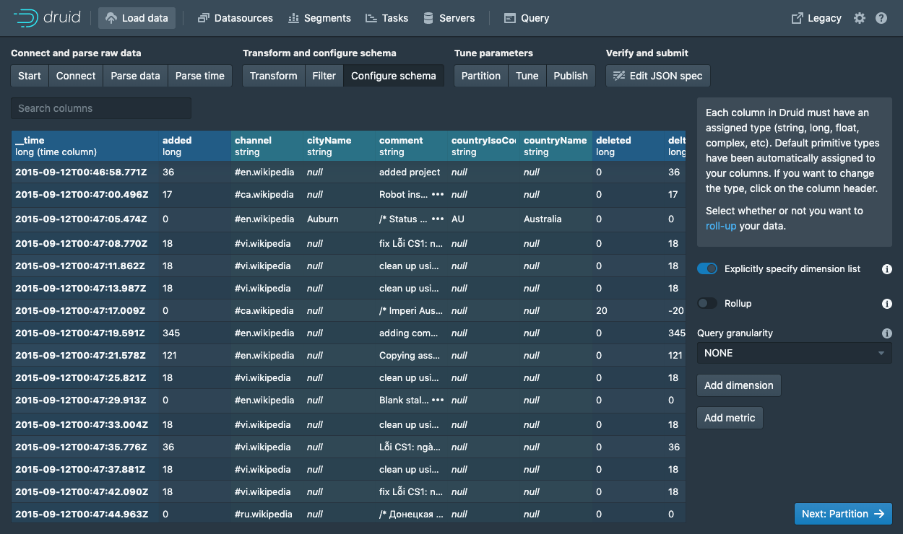
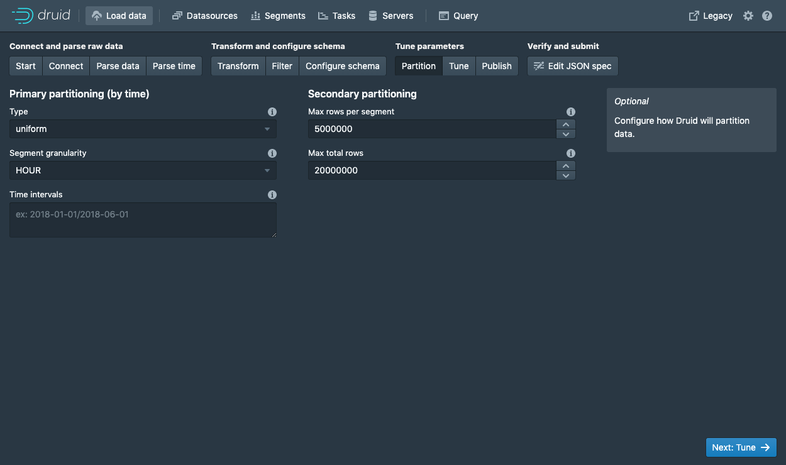
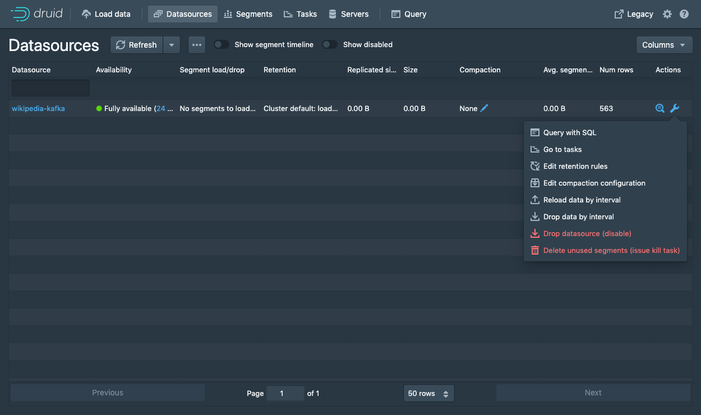
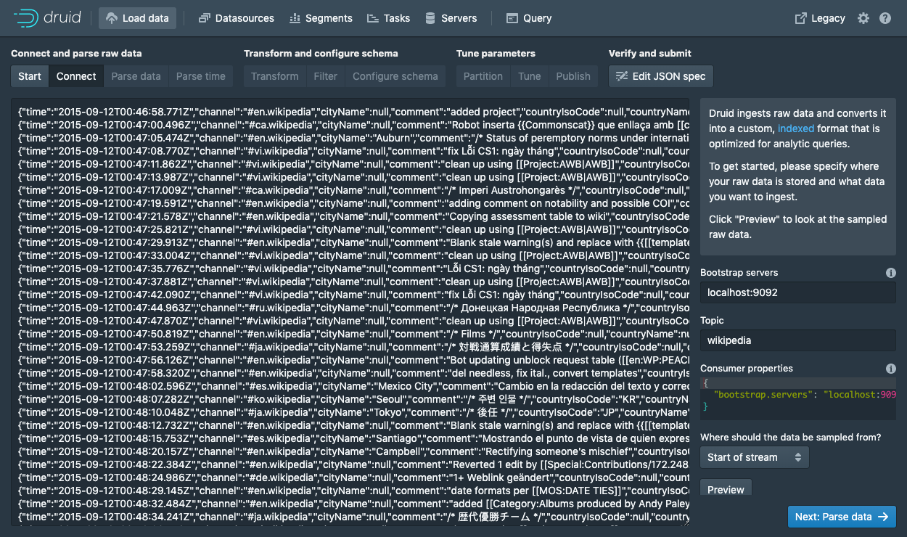
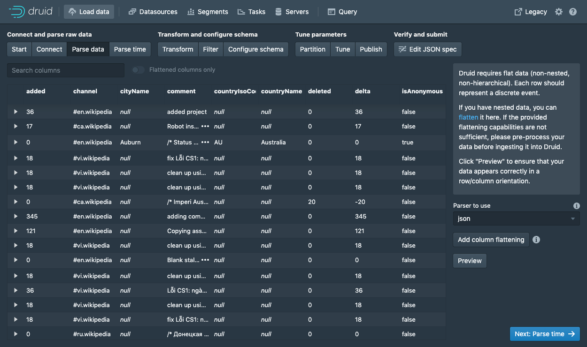

<!--
  ~ Licensed to the Apache Software Foundation (ASF) under one
  ~ or more contributor license agreements.  See the NOTICE file
  ~ distributed with this work for additional information
  ~ regarding copyright ownership.  The ASF licenses this file
  ~ to you under the Apache License, Version 2.0 (the
  ~ "License"); you may not use this file except in compliance
  ~ with the License.  You may obtain a copy of the License at
  ~
  ~   http://www.apache.org/licenses/LICENSE-2.0
  ~
  ~ Unless required by applicable law or agreed to in writing,
  ~ software distributed under the License is distributed on an
  ~ "AS IS" BASIS, WITHOUT WARRANTIES OR CONDITIONS OF ANY
  ~ KIND, either express or implied.  See the License for the
  ~ specific language governing permissions and limitations
  ~ under the License.
  -->


## Getting started

This tutorial demonstrates how to load data into Apache Druid from a Kafka stream, using Druid's Kafka indexing service.

For this tutorial, we'll assume you've already downloaded Druid as described in
the [quickstart](index.html) using the `micro-quickstart` single-machine configuration and have it
running on your local machine. You don't need to have loaded any data yet.

## Download and start Kafka

[Apache Kafka](http://kafka.apache.org/) is a high throughput message bus that works well with
Druid.  For this tutorial, we will use Kafka 2.1.0. To download Kafka, issue the following
commands in your terminal:

```bash
curl -O https://archive.apache.org/dist/kafka/2.1.0/kafka_2.12-2.1.0.tgz
tar -xzf kafka_2.12-2.1.0.tgz
cd kafka_2.12-2.1.0
```

Start a Kafka broker by running the following command in a new terminal:

```bash
./bin/kafka-server-start.sh config/server.properties
```

Run this command to create a Kafka topic called *wikipedia*, to which we'll send data:

```bash
./bin/kafka-topics.sh --create --zookeeper localhost:2181 --replication-factor 1 --partitions 1 --topic wikipedia
```     

## Load data into Kafka

Let's launch a producer for our topic and send some data!

In your Druid directory, run the following command:

```bash
cd quickstart/tutorial
gunzip -c wikiticker-2015-09-12-sampled.json.gz > wikiticker-2015-09-12-sampled.json
```

In your Kafka directory, run the following command, where {PATH_TO_DRUID} is replaced by the path to the Druid directory:

```bash
export KAFKA_OPTS="-Dfile.encoding=UTF-8"
./bin/kafka-console-producer.sh --broker-list localhost:9092 --topic wikipedia < {PATH_TO_DRUID}/quickstart/tutorial/wikiticker-2015-09-12-sampled.json
```

The previous command posted sample events to the *wikipedia* Kafka topic.
Now we will use Druid's Kafka indexing service to ingest messages from our newly created topic.

## Loading data with the data loader

Navigate to [localhost:8888](http://localhost:8888) and click `Load data` in the console header.


Select `Apache Kafka` and click `Connect data`.


Enter `localhost:9092` as the bootstrap server and `wikipedia` as the topic.

Click `Apply` and make sure that the data you are seeing is correct.

Once the data is located, you can click "Next: Parse data" to go to the next step.


The data loader will try to automatically determine the correct parser for the data.
In this case it will successfully determine `json`.
Feel free to play around with different parser options to get a preview of how Druid will parse your data.

With the `json` parser selected, click `Next: Parse time` to get to the step centered around determining your primary timestamp column.


Druid's architecture requires a primary timestamp column (internally stored in a column called `__time`).
If you do not have a timestamp in your data, select `Constant value`.
In our example, the data loader will determine that the `time` column in our raw data is the only candidate that can be used as the primary time column.

Click `Next: ...` twice to go past the `Transform` and `Filter` steps.
You do not need to enter anything in these steps as applying ingestion time transforms and filters are out of scope for this tutorial.



In the `Configure schema` step, you can configure which [dimensions](../ingestion/index.md#dimensions) and [metrics](../ingestion/index.md#metrics) will be ingested into Druid.
This is exactly what the data will appear like in Druid once it is ingested.
Since our dataset is very small, go ahead and turn off [`Rollup`](../ingestion/index.md#rollup) by clicking on the switch and confirming the change.

Once you are satisfied with the schema, click `Next` to go to the `Partition` step where you can fine tune how the data will be partitioned into segments.



Here, you can adjust how the data will be split up into segments in Druid.
Since this is a small dataset, there are no adjustments that need to be made in this step.

Click `Next: Tune` to go to the tuning step.


In the `Tune` step is it *very important* to set `Use earliest offset` to `True` since we want to consume the data from the start of the stream.
There are no other changes that need to be made hear, so click `Next: Publish` to go to the `Publish` step.


Let's name this datasource `wikipedia-kafka`.

Finally, click `Next` to review your spec.


This is the spec you have constructed.
Feel free to go back and make changes in previous steps to see how changes will update the spec.
Similarly, you can also edit the spec directly and see it reflected in the previous steps.

Once you are satisfied with the spec, click `Submit` and an ingestion task will be created.


You will be taken to the task view with the focus on the newly created supervisor.

The task view is set to auto refresh, wait until your supervisor launches a task.

When a tasks starts running, it will also start serving the data that it is ingesting.

Navigate to the `Datasources` view from the header.



When the `wikipedia-kafka` datasource appears here it can be queried. 

*Note:* if the datasource does not appear after a minute you might have not set the supervisor to read from the start of the stream (in the `Tune` step).

At this point, you can go to the `Query` view to run SQL queries against the datasource.

Since this is a small dataset, you can simply run a `SELECT * FROM "wikipedia-kafka"` query to see your results.


Check out the [query tutorial](../tutorials/tutorial-query.md) to run some example queries on the newly loaded data.


### Submit a supervisor via the console

In the console, click `Submit supervisor` to open the submit supervisor dialog.


Paste in this spec and click `Submit`.

```json
{
  "type": "kafka",
  "spec" : {
    "dataSchema": {
      "dataSource": "wikipedia",
      "timestampSpec": {
        "column": "time",
        "format": "auto"
      },
      "dimensionsSpec": {
        "dimensions": [
          "channel",
          "cityName",
          "comment",
          "countryIsoCode",
          "countryName",
          "isAnonymous",
          "isMinor",
          "isNew",
          "isRobot",
          "isUnpatrolled",
          "metroCode",
          "namespace",
          "page",
          "regionIsoCode",
          "regionName",
          "user",
          { "name": "added", "type": "long" },
          { "name": "deleted", "type": "long" },
          { "name": "delta", "type": "long" }
        ]
      },
      "metricsSpec" : [],
      "granularitySpec": {
        "type": "uniform",
        "segmentGranularity": "DAY",
        "queryGranularity": "NONE",
        "rollup": false
      }
    },
    "tuningConfig": {
      "type": "kafka",
      "reportParseExceptions": false
    },
    "ioConfig": {
      "topic": "wikipedia",
      "inputFormat": {
        "type": "json"
      },
      "replicas": 2,
      "taskDuration": "PT10M",
      "completionTimeout": "PT20M",
      "consumerProperties": {
        "bootstrap.servers": "localhost:9092"
      }
    }
  }
}
```

This will start the supervisor that will in turn spawn some tasks that will start listening for incoming data.

### Submit a supervisor directly

To start the service directly, we will need to submit a supervisor spec to the Druid overlord by running the following from the Druid package root:

```bash
curl -XPOST -H'Content-Type: application/json' -d @quickstart/tutorial/wikipedia-kafka-supervisor.json http://localhost:8081/druid/indexer/v1/supervisor
```


If the supervisor was successfully created, you will get a response containing the ID of the supervisor; in our case we should see `{"id":"wikipedia"}`.

For more details about what's going on here, check out the
[Druid Kafka indexing service documentation](../development/extensions-core/kafka-ingestion.md).

You can view the current supervisors and tasks in the Druid Console: [http://localhost:8888/unified-console.html#tasks](http://localhost:8888/unified-console.html#tasks).

## Querying your data

After data is sent to the Kafka stream, it is immediately available for querying.

Please follow the [query tutorial](../tutorials/tutorial-query.md) to run some example queries on the newly loaded data.

## Cleanup

To go through any of the other ingestion tutorials, you will need to shut down the cluster and reset the cluster state by removing the contents of the `var` directory in the Druid home, as the other tutorials will write to the same "wikipedia" datasource.

You should additionally clear out any Kafka state. Do so by shutting down the Kafka broker with CTRL-C before stopping ZooKeeper and the Druid services, and then deleting the Kafka log directory at `/tmp/kafka-logs`:

```bash
rm -rf /tmp/kafka-logs
```


## Further reading

For more information on loading data from Kafka streams, please see the [Druid Kafka indexing service documentation](../development/extensions-core/kafka-ingestion.md).


## 教程：从Kafka中加载流式数据
### 入门

本教程演示了如何使用Druid的Kafka索引服务将数据从Kafka流加载到Apache Druid中。

在本教程中，我们假设您已经按照快速入门中的说明下载了Druid并使用 `micro-quickstart`单机配置使其在本地计算机上运行。您不需要加载任何数据。

### 下载并启动Kafka

[Apache Kafka](http://kafka.apache.org/)是一种高吞吐量消息总线，可与Druid很好地配合使用。在本教程中，我们将使用Kafka2.1.0。要下载Kafka，请在终端中执行以下命令：

```json
curl -O https://archive.apache.org/dist/kafka/2.1.0/kafka_2.12-2.1.0.tgz
tar -xzf kafka_2.12-2.1.0.tgz
cd kafka_2.12-2.1.0
```
通过在终端中运行以下命令来启动一个Kafka Broker：

```json
./bin/kafka-server-start.sh config/server.properties
```

执行以下命令来创建一个我们用来发送数据的Kafka主题，称为"*wikipedia*":

```json
./bin/kafka-topics.sh --create --zookeeper localhost:2181 --replication-factor 1 --partitions 1 --topic wikipedia
```

### 发送数据到Kafka

让我们为该主题启动一个生产者并发送一些数据

在Druid目录下，运行下边的命令：
```json
cd quickstart/tutorial
gunzip -c wikiticker-2015-09-12-sampled.json.gz > wikiticker-2015-09-12-sampled.json
```

在Kafka目录下，运行以下命令，{PATH_TO_DRUID}替换为Druid目录的路径：
```json
export KAFKA_OPTS="-Dfile.encoding=UTF-8"
./bin/kafka-console-producer.sh --broker-list localhost:9092 --topic wikipedia < {PATH_TO_DRUID}/quickstart/tutorial/wikiticker-2015-09-12-sampled.json
```

上一个命令将示例事件发布到名称为*wikipedia*的Kafka主题。现在，我们将使用Druid的Kafka索引服务从新创建的主题中提取消息。

### 使用数据加载器（Data Loader）

浏览器访问 [localhost:8888](http://localhost:8888) 然后点击控制台中的 `Load data`


选择 `Apache Kafka` 然后点击 `Connect data`



在 `Bootstrap servers` 输入 `localhost:9092`, 在 `Topic` 输入 `wikipedia`

点击 `Preview` 后确保您看到的数据是正确的

数据定位后，您可以点击"Next: Parse data"来进入下一步。



数据加载器将尝试自动为数据确定正确的解析器。在这种情况下，它将成功确定`json`。可以随意使用不同的解析器选项来预览Druid如何解析您的数据。

`json` 选择器被选中后，点击 `Next：Parse time` 进入下一步来决定您的主时间列。


Druid的体系结构需要一个主时间列（内部存储为名为__time的列）。如果您的数据中没有时间戳，请选择 `固定值（Constant Value）` 。在我们的示例中，数据加载器将确定原始数据中的时间列是唯一可用作主时间列的候选者。

点击"Next:..."两次完成 `Transform` 和 `Filter` 步骤。您无需在这些步骤中输入任何内容，因为使用摄取时间变换和过滤器不在本教程范围内。


在 `Configure schema` 步骤中，您可以配置将哪些维度和指标摄入到Druid中，这些正是数据在被Druid中摄取后出现的样子。 由于我们的数据集非常小，关掉rollup、确认更改。

一旦对schema满意后，点击 `Next` 后进入 `Partition` 步骤，该步骤中可以调整数据如何划分为段文件的方式。


在这里，您可以调整如何在Druid中将数据拆分为多个段。 由于这是一个很小的数据集，因此在此步骤中无需进行任何调整。

点击完成 `Tune` 步骤。


在 `Tune` 步骤中，将 `Use earliest offset` 设置为 `True` *非常重要*，因为我们需要从流的开始位置消费数据。 其他没有任何需要更改的地方，进入到 `Publish` 步


我们将该数据源命名为 `wikipedia-kafka`

最后点击 `Next` 预览摄入规范：


这就是您构建的规范，为了查看更改将如何更新规范是可以随意返回之前的步骤中进行更改，同样，您也可以直接编辑规范，并在前面的步骤中看到它。

对摄取规范感到满意后，请单击 `Submit`，然后将创建一个数据摄取任务


您可以进入任务视图，重点关注新创建的supervisor。任务视图设置为自动刷新，请等待直到Supervisor启动了一个任务。

当一项任务开始运行时，它将开始处理其摄入的数据。

从标题导航到 `Datasources` 视图。


当 `wikipedia-kafka` 数据源出现在这儿的时候就可以被查询了。

> ![TIPS]
> 如果过了几分钟之后数据源还是没有出现在这里，可能是在 `Tune` 步骤中没有设置为从流的开始进行消费数据

此时，就可以在 `Query` 视图中运行SQL查询了，因为这是一个小的数据集，你可以简单的运行 `SELECT * FROM "wikipedia-kafka"` 来查询结果。


查看[查询教程](../querying/makeNativeQueries.md)以对新加载的数据运行一些示例查询。

#### 通过控制台提交supervisor

在控制台中点击 `Submit supervisor` 打开提交supervisor对话框：


粘贴以下规范后点击 `Submit`

```json
{
  "type": "kafka",
  "spec" : {
    "dataSchema": {
      "dataSource": "wikipedia",
      "timestampSpec": {
        "column": "time",
        "format": "auto"
      },
      "dimensionsSpec": {
        "dimensions": [
          "channel",
          "cityName",
          "comment",
          "countryIsoCode",
          "countryName",
          "isAnonymous",
          "isMinor",
          "isNew",
          "isRobot",
          "isUnpatrolled",
          "metroCode",
          "namespace",
          "page",
          "regionIsoCode",
          "regionName",
          "user",
          { "name": "added", "type": "long" },
          { "name": "deleted", "type": "long" },
          { "name": "delta", "type": "long" }
        ]
      },
      "metricsSpec" : [],
      "granularitySpec": {
        "type": "uniform",
        "segmentGranularity": "DAY",
        "queryGranularity": "NONE",
        "rollup": false
      }
    },
    "tuningConfig": {
      "type": "kafka",
      "reportParseExceptions": false
    },
    "ioConfig": {
      "topic": "wikipedia",
      "inputFormat": {
        "type": "json"
      },
      "replicas": 2,
      "taskDuration": "PT10M",
      "completionTimeout": "PT20M",
      "consumerProperties": {
        "bootstrap.servers": "localhost:9092"
      }
    }
  }
}
```

这将启动supervisor，该supervisor继而产生一些任务，这些任务将开始监听传入的数据。

#### 直接提交supervisor

为了直接启动服务，我们可以在Druid的根目录下运行以下命令来提交一个supervisor规范到Druid Overlord中

```json
curl -XPOST -H'Content-Type: application/json' -d @quickstart/tutorial/wikipedia-kafka-supervisor.json http://localhost:8081/druid/indexer/v1/supervisor
```
如果supervisor被成功创建后，将会返回一个supervisor的ID，在本例中看到的是 `{"id":"wikipedia"}`

更详细的信息可以查看[Druid Kafka索引服务文档](../DataIngestion/kafka.md)

您可以在[Druid控制台]( http://localhost:8888/unified-console.html#tasks)中查看现有的supervisors和tasks

### 数据查询
数据被发送到Kafka流之后，立刻就可以被查询了。

按照[查询教程](./chapter-4.md)的操作，对新加载的数据执行一些示例查询
### 清理数据
如果您希望阅读其他任何入门教程，则需要关闭集群并通过删除druid软件包下的`var`目录的内容来重置集群状态，因为其他教程将写入相同的"wikipedia"数据源。
### 进一步阅读
更多关于从Kafka流加载数据的信息，可以查看[Druid Kafka索引服务文档](../DataIngestion/kafka.md)