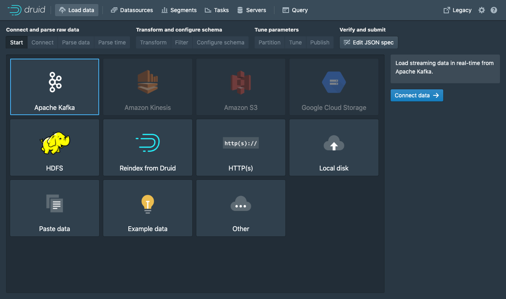
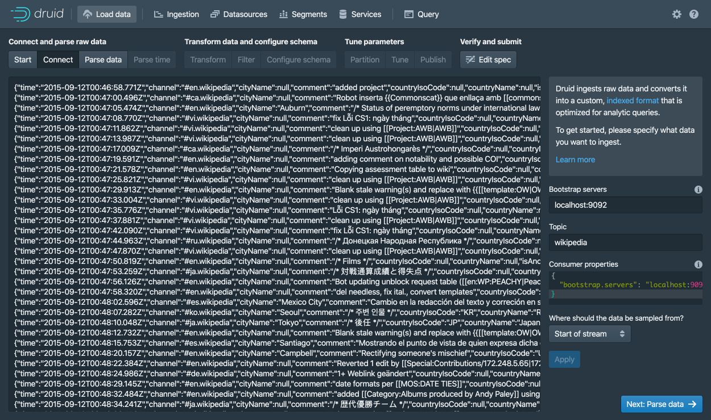
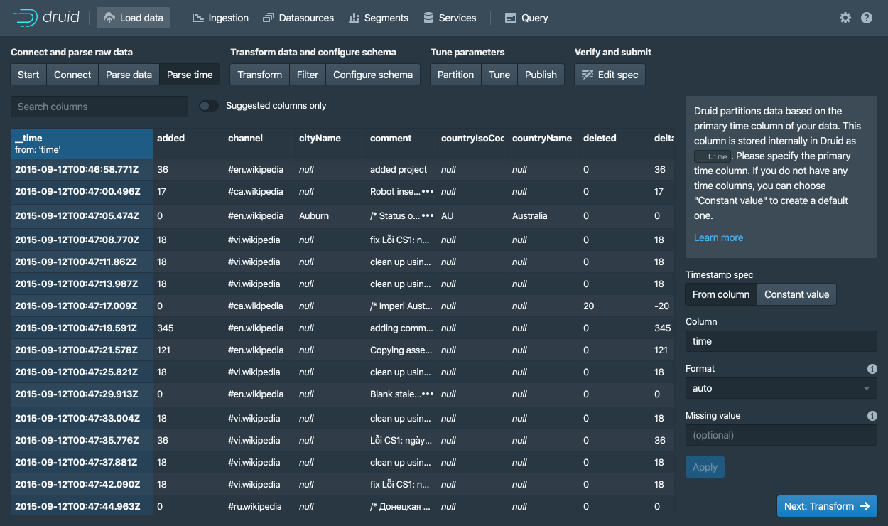
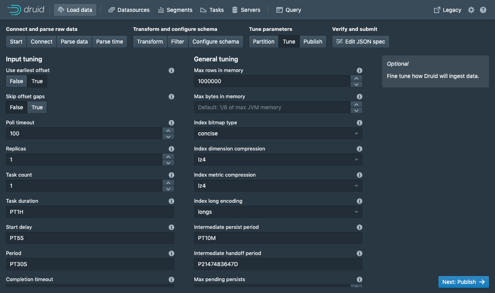
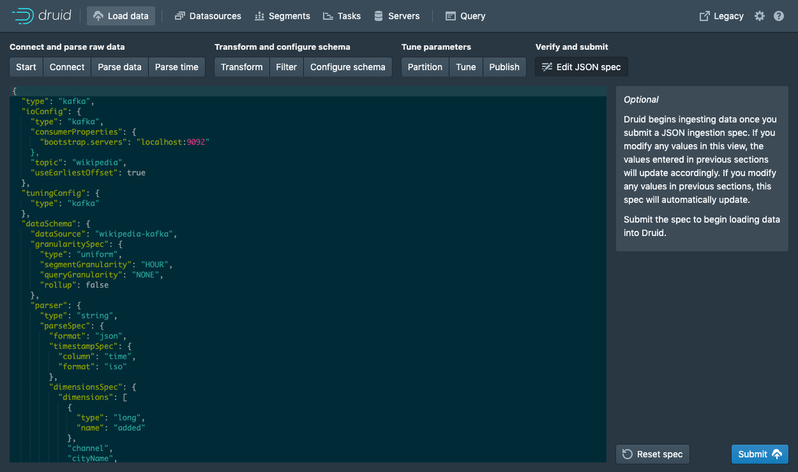
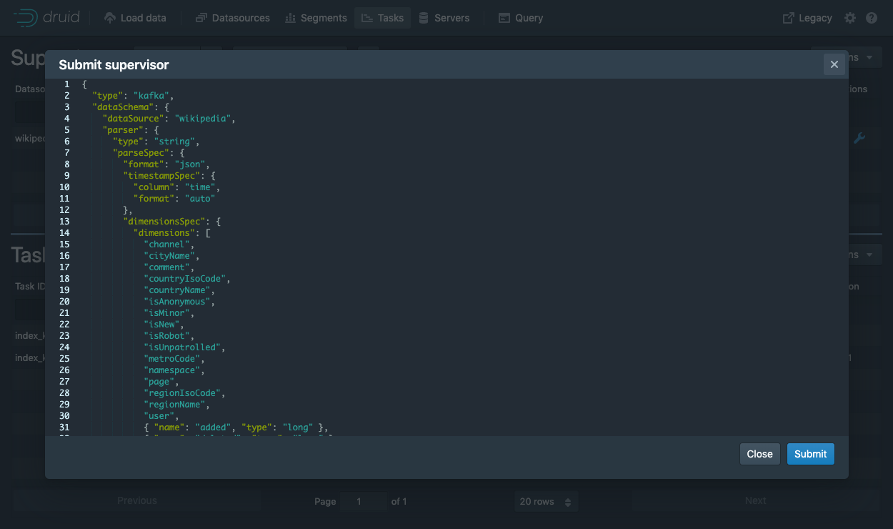

# Kafka 数据加载教程

本教程演示了如何使用Druid的Kafka索引服务将数据从Kafka流加载到Apache Druid中。

假设你已经完成了 [快速开始](../tutorials/index.md) 页面中的内容或者下面页面中有关的内容，并且你的 Druid 实例已使用 `micro-quickstart` 配置在你的本地的计算机上运行了。
到目前，你还不需要加载任何数据。

## 下载和启动 Kafka

[Apache Kafka](http://kafka.apache.org/) 是一个高吞吐量消息总线，可与 Druid 很好地配合使用。
在本指南中，我们将使用 Kafka 2.1.0 版本。下载 Kafka 后，在你的控制终端上运行下面的命令：

```bash
curl -O https://archive.apache.org/dist/kafka/2.1.0/kafka_2.12-2.1.0.tgz
tar -xzf kafka_2.12-2.1.0.tgz
cd kafka_2.12-2.1.0
```

如果你需要启动 Kafka broker，你需要通过控制台运行下面的命令：

```bash
./bin/kafka-server-start.sh config/server.properties
```

使用下面的命令在 Kafka 中创建一个称为 *wikipedia* 的主题，这个主题就是你需要将消息数据发送到的主题：

```bash
./bin/kafka-topics.sh --create --zookeeper localhost:2181 --replication-factor 1 --partitions 1 --topic wikipedia
```     

## 将数据载入到 Kafka
现在让我们为我们的主题运行一个生成器（producer），然后向主题中发送一些数据！

在你的 Druid 目录中，运行下面的命令：

```bash
cd quickstart/tutorial
gunzip -c wikiticker-2015-09-12-sampled.json.gz > wikiticker-2015-09-12-sampled.json
```

在你的 Kafka 的安装目录中，运行下面的命令。请将 {PATH_TO_DRUID} 替换为 Druid 的安装目录：

```bash
export KAFKA_OPTS="-Dfile.encoding=UTF-8"
./bin/kafka-console-producer.sh --broker-list localhost:9092 --topic wikipedia < {PATH_TO_DRUID}/quickstart/tutorial/wikiticker-2015-09-12-sampled.json
```

上面的控制台命令将会把示例消息载入到 Kafka 的 *wikipedia* 主题。
现在我们将会使用 Druid 的 Kafka 索引服务（indexing service）来将我们加载到 Kafka 中的消息导入到 Druid 中。

## 使用数据加载器（data loader）来加载数据
在 URL 中导航到 [localhost:8888](http://localhost:8888) 页面，然后在控制台的顶部单击`Load data`。



选择 `Apache Kafka` 然后单击 `Connect data`。



输入 Kafka 的服务器地址为 `localhost:9092` 然后选择 `wikipedia` 为主题。

然后单击 `Apply`。请确定你在界面中看到的数据只正确的。

一旦数据被载入后，你可以单击按钮 "Next: Parse data" 来进行下一步的操作。


Druid 的数据加载器将会为需要加载的数据确定正确的处理器。
在本用例中，我们成功的确定了需要处理的数据格式为 `json` 格式。
你可以在本页面中选择不同的数据处理器，通过选择不同的数据处理器，能够帮你更好的了解 Druid 是如何帮助你处理数据的。

当 `json` 格式的数据处理器被选择后，单击 `Next: Parse time` 来进行入下一个界面，在这个界面中你需要确定 timestamp 主键字段的的列。



Druid 要求所有数据必须有一个 timestamp 的主键字段（这个主键字段被定义和存储在 `__time`）中。
如果你需要导入的数据没有时间字段的话，那么请选择  `Constant value`。
在我们现在的示例中，数据载入器确定 `time` 字段是唯一可以被用来作为数据时间字段的数据。


单击 `Next: ...` 2 次，来跳过 `Transform` 和 `Filter` 步骤。
针对本教程来说，你并不需要对导入时间进行换行，所以你不需要调整 转换（Transform） 和 过滤器（Filter） 的配置。


配置摘要（schema） 是你对 [dimensions](../ingestion/index.md#dimensions) 和 [metrics](../ingestion/index.md#metrics) 在导入数据的时候配置的地方。
这个界面显示的是当我们对数据在 Druid 中进行导入的时候，数据是如何在 Druid 中进行存储和表现的。
因为我们提交的数据集非常小，因此我们可以关闭 [回滚（rollup）](../ingestion/index.md#rollup) ，**Rollup** 的开关将不会在这个时候显示来供你选择。

如果你对当前的配置满意的话，单击 `Next` 来进入 `Partition` 步骤。在这个步骤中你可以定义数据是如何在段中进行分区的。


在这一步中，你可以调整你的数据是如何在段中进行分配的。
因为当前的数据集是一个非常小的数据库，我们在这一步不需要进行调制。

单击 `Next: Tune` 来进入性能配置页面。



`Tune` 这一步中一个 *非常重要* 的参数是 `Use earliest offset` 设置为 `True`。
因为我们希望从流的开始来读取数据。
针对其他的配置，我们不需要进行修改，单击  `Next: Publish` 来进入 `Publish` 步骤。


让我们将数据源命名为 `wikipedia-kafka`。

最后，单击 `Next` 来查看你的配置。



等到这一步的时候，你就可以看到如何使用数据导入来创建一个数据导入规范。
你可以随意的通过页面中的导航返回到前面的页面中对配置进行调整。
简单来说你可以对特性目录进行编辑，来查看编辑后的配置是如何对前面的步骤产生影响的。

当你对所有的配置都满意并且觉得没有问题的时候，单击 **提交（Submit）**.


现在你需要到界面下半部分的任务视图（task view）中来查看通过 supervisor 创建的任务。

任务视图（task view）是被设置为自动刷新的，请等候 supervisor 来运行一个任务。

当一个任务启动运行后，这个任务将会对数据进行处理后导入到 Druid 中。

在页面的顶部，请导航到 `Datasources` 视图。


当 `wikipedia-kafka` 数据源成功显示，这个数据源中的数据就可以进行查询了。 

*请注意：* 如果数据源在经过一段时间的等待后还是没有数据的话，那么很有可能是你的 supervisor 没有设置从 Kafka 的开头读取流数据（`Tune` 步骤中的配置）。

在数据源完成所有的数据导入后，你可以进入 `Query` 视图，来针对导入的数据源来运行 SQL 查询。

因为我们当前导入的数据库很小，你可以直接运行`SELECT * FROM "wikipedia-kafka"` 查询来查看数据导入的结果。


请访问 [query tutorial](../tutorials/tutorial-query.md) 页面中的内容来了解如何针对一个新载入的数据如何运行查询。


### 通过控制台来提交一个 supervisor 

在控制台中，单击 `Submit supervisor` 来打开一个 supervisor 对话框。



请将下面的内容配置参数拷贝张贴到打开的对话框中，然后单击 `Submit` 提交。

```json
{
  "type": "kafka",
  "spec" : {
    "dataSchema": {
      "dataSource": "wikipedia",
      "timestampSpec": {
        "column": "time",
        "format": "auto"
      },
      "dimensionsSpec": {
        "dimensions": [
          "channel",
          "cityName",
          "comment",
          "countryIsoCode",
          "countryName",
          "isAnonymous",
          "isMinor",
          "isNew",
          "isRobot",
          "isUnpatrolled",
          "metroCode",
          "namespace",
          "page",
          "regionIsoCode",
          "regionName",
          "user",
          { "name": "added", "type": "long" },
          { "name": "deleted", "type": "long" },
          { "name": "delta", "type": "long" }
        ]
      },
      "metricsSpec" : [],
      "granularitySpec": {
        "type": "uniform",
        "segmentGranularity": "DAY",
        "queryGranularity": "NONE",
        "rollup": false
      }
    },
    "tuningConfig": {
      "type": "kafka",
      "reportParseExceptions": false
    },
    "ioConfig": {
      "topic": "wikipedia",
      "inputFormat": {
        "type": "json"
      },
      "replicas": 2,
      "taskDuration": "PT10M",
      "completionTimeout": "PT20M",
      "consumerProperties": {
        "bootstrap.servers": "localhost:9092"
      }
    }
  }
}
```

上面将会启动一个 supervisor，启动 supervisor 将会负责对任务进行管理，使用启动的任务来完成对数据的输入和从 Kafka 中获取数据。

### 直接提交一个 supervisor

To start the service directly, we will need to submit a supervisor spec to the Druid overlord by running the following from the Druid package root:

```bash
curl -XPOST -H'Content-Type: application/json' -d @quickstart/tutorial/wikipedia-kafka-supervisor.json http://localhost:8081/druid/indexer/v1/supervisor
```


If the supervisor was successfully created, you will get a response containing the ID of the supervisor; in our case we should see `{"id":"wikipedia"}`.

For more details about what's going on here, check out the
[Druid Kafka indexing service documentation](../development/extensions-core/kafka-ingestion.md).

You can view the current supervisors and tasks in the Druid Console: [http://localhost:8888/unified-console.html#tasks](http://localhost:8888/unified-console.html#tasks).

## Querying your data

After data is sent to the Kafka stream, it is immediately available for querying.

Please follow the [query tutorial](../tutorials/tutorial-query.md) to run some example queries on the newly loaded data.

## Cleanup

To go through any of the other ingestion tutorials, you will need to shut down the cluster and reset the cluster state by removing the contents of the `var` directory in the Druid home, as the other tutorials will write to the same "wikipedia" datasource.

You should additionally clear out any Kafka state. Do so by shutting down the Kafka broker with CTRL-C before stopping ZooKeeper and the Druid services, and then deleting the Kafka log directory at `/tmp/kafka-logs`:

```bash
rm -rf /tmp/kafka-logs
```


## Further reading

For more information on loading data from Kafka streams, please see the [Druid Kafka indexing service documentation](../development/extensions-core/kafka-ingestion.md).


#### 通过控制台提交supervisor

在控制台中点击 `Submit supervisor` 打开提交supervisor对话框：


粘贴以下规范后点击 `Submit`

```json
{
  "type": "kafka",
  "spec" : {
    "dataSchema": {
      "dataSource": "wikipedia",
      "timestampSpec": {
        "column": "time",
        "format": "auto"
      },
      "dimensionsSpec": {
        "dimensions": [
          "channel",
          "cityName",
          "comment",
          "countryIsoCode",
          "countryName",
          "isAnonymous",
          "isMinor",
          "isNew",
          "isRobot",
          "isUnpatrolled",
          "metroCode",
          "namespace",
          "page",
          "regionIsoCode",
          "regionName",
          "user",
          { "name": "added", "type": "long" },
          { "name": "deleted", "type": "long" },
          { "name": "delta", "type": "long" }
        ]
      },
      "metricsSpec" : [],
      "granularitySpec": {
        "type": "uniform",
        "segmentGranularity": "DAY",
        "queryGranularity": "NONE",
        "rollup": false
      }
    },
    "tuningConfig": {
      "type": "kafka",
      "reportParseExceptions": false
    },
    "ioConfig": {
      "topic": "wikipedia",
      "inputFormat": {
        "type": "json"
      },
      "replicas": 2,
      "taskDuration": "PT10M",
      "completionTimeout": "PT20M",
      "consumerProperties": {
        "bootstrap.servers": "localhost:9092"
      }
    }
  }
}
```

这将启动supervisor，该supervisor继而产生一些任务，这些任务将开始监听传入的数据。

#### 直接提交supervisor

为了直接启动服务，我们可以在Druid的根目录下运行以下命令来提交一个supervisor规范到Druid Overlord中

```json
curl -XPOST -H'Content-Type: application/json' -d @quickstart/tutorial/wikipedia-kafka-supervisor.json http://localhost:8081/druid/indexer/v1/supervisor
```
如果supervisor被成功创建后，将会返回一个supervisor的ID，在本例中看到的是 `{"id":"wikipedia"}`

更详细的信息可以查看[Druid Kafka索引服务文档](../ingestion/kafka.md)

您可以在[Druid控制台]( http://localhost:8888/unified-console.html#tasks)中查看现有的supervisors和tasks

### 数据查询
数据被发送到Kafka流之后，立刻就可以被查询了。

按照[查询教程](./chapter-4.md)的操作，对新加载的数据执行一些示例查询
### 清理数据
如果您希望阅读其他任何入门教程，则需要关闭集群并通过删除druid软件包下的`var`目录的内容来重置集群状态，因为其他教程将写入相同的"wikipedia"数据源。
### 进一步阅读
更多关于从Kafka流加载数据的信息，可以查看[Druid Kafka索引服务文档](../ingestion/kafka.md)