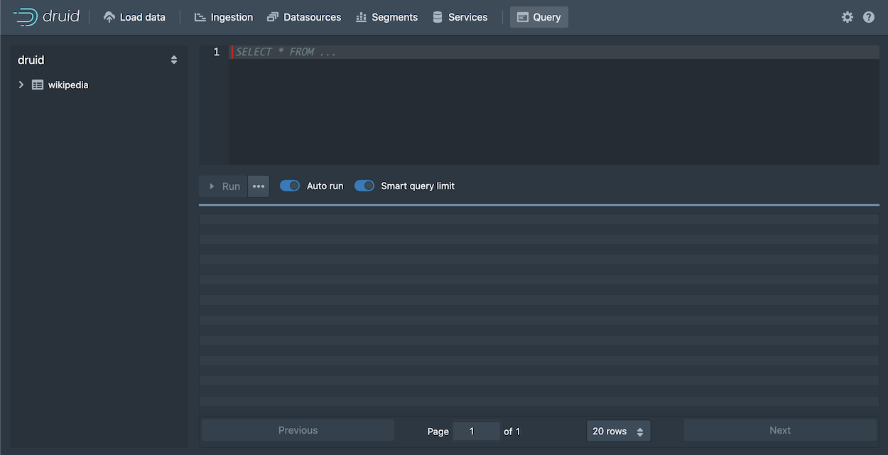

# 查询数据

本教程文档主要为了对如何在 Apache Druid 使用 SQL 进行查询进行说明。  

假设你已经完成了 [快速开始](../tutorials/index.md) 页面中的内容或者下面页面中有关的内容的内容。因为在 Apache Druid 中进行查询之前，
你需要将注入导入到 Druid 后才能够让进行下一步的操作：

* [教程：载入一个文件](../tutorials/tutorial-batch.md)
* [教程：从 Kafka 中载入流数据](../tutorials/tutorial-kafka.md)
* [教程：使用 Hadoop 载入一个文件](../tutorials/tutorial-batch-hadoop.md)

有多种方法能在 Druid 中运行 SQL 查询：从 Druid 控制台中进行查询；使用命令行工具（command line utility）进行查询查询；使用 HTTP 方式进行查询。

下面我们将会针对各种查询方式进行说明。


## 从 Druid 控制台（Druid console）中进行查询

Druid 控制台提供了视图能够让用户更加容易的在 Druid 进行查询测试，并且查看查询返回的结果。

1. 如果你的 Druid 没有启动的话，你需要先行启动 Druid 集群，然后通过你的浏览器访问 Druid 控制台。

2. 单击顶部的 **查询（Query）** 导航进入查询界面：  

   

   你可以在编辑器中直接写查询语句和脚本，同时 Query 查询输入对话框也提供了代码自动完成功能帮助你完成需要使用的查询语句。

3. 从左侧的面板中打开 wikipedia 数据源，我们将会从这里对数据源中的 page 进行查询。  

4. 单击 `page` 然后从菜单中选项 **Show:page** ： 

   

   SELECT 查询语句将会在查询编辑器中显示。但是，现在如果你进行查询的话是没有任何返回数据的，这是因为默认的查询时间为最近的一天，
   但是我们的数据已经远比这个数据老。因此我们需要删除这个过滤器（filter）。  

5. 在 datasource 的树中，单击 `__time` 然后选择 **Remove Filter** 

   

6. 单击 **Run** 来运行这个查询。

   你应该在返回的对话框中看到 2 列的数据，这个包括有 page name 和 count:

   

   需要注意的是，通过控制台进行查询的返回结果集被限制为默认 100 条记录，这是在 **Smart query limit** 特性中进行配置的。
   这个能够帮助用户避免在运行查询的时候返回大量的数据，有可能会让其系统过载。

7. 让我们对上面的查询语句进行一些编辑来看看在查询构建器中能够提供那些特性，请在查询构建起器中进行下面的一些修改：

   1. 第一列的 `"page"` 后面开始输入一个新列的名字 `"countryName"`。请注意自动完成菜单将会针对你输入的字符提示 列名，函数，关键字以及其他的内容
   选择 "countryName" 和添加新的列到 GROUP BY 语句中，可以通过名字或者位置 `2` 来完成操作。

   2. 为了让我们的 SQL 更加具有可读性，将 `Count` 列的名字替换为 `Edits`，这是因为这一列是使用 `COUNT()` 函数来进行计算的，实际上的目的是返回编辑的次数。
   在 ORDER BY 语句中使用同样的名字来进行排序。 

      `COUNT()` 函数是 Druid 提供的多个可用函数的一个。你可以将你的鼠标移动到函数的名字上面，在随后弹出的自动完成对话框中将会对函数的功能进行一个简要的描述
      同时，你可以可以通过 Druid 的文档来了解更多的内容，例如, `COUNT()` 函数的文档位于 [Aggregation functions](../querying/sql.md#aggregation-functions) 页面中。 

   当完成上面的所有操作后，你的 SQL 脚本应该看起来和下面的是一样的了：

   ```sql
   SELECT
     "page",
     "countryName",
     COUNT(*) AS "Edits"
   FROM "wikipedia"
   GROUP BY 1, 2
   ORDER BY "Edits" DESC
   ``` 

   当你对上面的 SQL 脚本再次运行以后，你会注意到我们会返回一个新的列（dimension）为 `countryName`，但是这一列的大部分行的值都是空的。 
   让我们通过修改 SQL 来只显示 `countryName` 不为空的行。

8. 单击 countryName 这一列，在左侧的面部中选择第一个过滤器（first filtering）的选项。这个过滤器的内容可能并不是我们想要的，我们会在后面对其进行编辑
WHERE 语句将会显示在你的查询中。 

9. 修改 WHERE 语句来将 countryName 不为空的列去除掉。 

   ```sql
   WHERE "countryName" IS NOT NULL
   ``` 
   然后再次运行修改后的 SQL 脚本，你应该可以只看到编辑次数最多的国家：  

   

10. 在 Druid 使用 SQL 进行查询的后面，所有的 Druid SQL 查询都可以被转换为基于 JSON 格式的 _Druid native query_ 来在 Druid 的数据节点中进行查询。
你可以通过单击查询运行按钮的后面`...` 然后选择 **Explain SQL Query** 来进行查看。 

    尽管你可以在大部分的情况下使用 Druid SQL，但是如果你能够了解 Druid 原生查询的意义，那么对你在问题解决和有关性能问题的调试上面会更加有效，请参考 [Native queries](../querying/querying.md) 页面来获得更多信息。

    

     > Another way to view the explain plan is by adding EXPLAIN PLAN FOR to the front of your query, as follows:
     >
     >```sql
     >EXPLAIN PLAN FOR
     >SELECT
     >  "page",
     >  "countryName",
     >  COUNT(*) AS "Edits"
     >FROM "wikipedia"
     >WHERE "countryName" IS NOT NULL
     >GROUP BY 1, 2
     >ORDER BY "Edits" DESC
     >```
     >This is particularly useful when running queries 
     from the command line or over HTTP.


11. 最后，单击 `...`  然后选择 **Edit context** 来查看你可以添加的其他参数来控制查询的执行。
在这个字段中，可以通过输入基于 JSON 格式的 key-value 对，请参考 [Context flags](../querying/query-context.md) 页面描述的更多内容。

上面就是我们如何通过使用 Druid 控制的查询构建特性来构建的一个简单的数据查询。
在本页面的后续部分提供了更多的一些你可以尝试使用的查询实例。同时请查看 [进行查询的其他方法](#进行查询的其他方法) 部分中的内容来了解如何
在命令行工具或者 HTTP 上运行 Druid SQL 查询。 

## 更多的查询实例

下面是你可以在 Druid 上尝试进行查询的一些实例供你测试：

### 对时间进行查询

```sql
SELECT FLOOR(__time to HOUR) AS HourTime, SUM(deleted) AS LinesDeleted
FROM wikipedia WHERE "__time" BETWEEN TIMESTAMP '2015-09-12 00:00:00' AND TIMESTAMP '2015-09-13 00:00:00'
GROUP BY 1
```


### 基本的 group by

```sql
SELECT channel, page, SUM(added)
FROM wikipedia WHERE "__time" BETWEEN TIMESTAMP '2015-09-12 00:00:00' AND TIMESTAMP '2015-09-13 00:00:00'
GROUP BY channel, page
ORDER BY SUM(added) DESC
```


## 进行查询的其他方法

### 通过 dsql 进行查询

为了便于使用，Druid 包中还提供了一个 SQL 命令行客户端工具，这个工具位于 `bin/dsql` 目录中。

如果你直接运行 `bin/dsql` 的话，你将会看到下面的提示输出：

```bash
Welcome to dsql, the command-line client for Druid SQL.
Type "\h" for help.
dsql>
```

如果希望进行查询的话，将你的 SQL 张贴到 `dsql` 提示光标后面，然后单击回车：

```bash
dsql> SELECT page, COUNT(*) AS Edits FROM wikipedia WHERE "__time" BETWEEN TIMESTAMP '2015-09-12 00:00:00' AND TIMESTAMP '2015-09-13 00:00:00' GROUP BY page ORDER BY Edits DESC LIMIT 10;
┌──────────────────────────────────────────────────────────┬───────┐
│ page                                                     │ Edits │
├──────────────────────────────────────────────────────────┼───────┤
│ Wikipedia:Vandalismusmeldung                             │    33 │
│ User:Cyde/List of candidates for speedy deletion/Subpage │    28 │
│ Jeremy Corbyn                                            │    27 │
│ Wikipedia:Administrators' noticeboard/Incidents          │    21 │
│ Flavia Pennetta                                          │    20 │
│ Total Drama Presents: The Ridonculous Race               │    18 │
│ User talk:Dudeperson176123                               │    18 │
│ Wikipédia:Le Bistro/12 septembre 2015                    │    18 │
│ Wikipedia:In the news/Candidates                         │    17 │
│ Wikipedia:Requests for page protection                   │    17 │
└──────────────────────────────────────────────────────────┴───────┘
Retrieved 10 rows in 0.06s.
```


### Query SQL over HTTP

你可以通过 HTTP 协议将你的查询直接提交给 Druid Broker 进行处理。

本教程中有关将 SQL 转换为 JSON 的脚本保存在 `quickstart/tutorial/wikipedia-top-pages-sql.json` 文件中，让我们将上面的查询提交给 Druid Broker 进行处理：

```bash
curl -X 'POST' -H 'Content-Type:application/json' -d @quickstart/tutorial/wikipedia-top-pages-sql.json http://localhost:8888/druid/v2/sql
```

下面的结构将会显示查询执行后的返回结果：

```json
[
  {
    "page": "Wikipedia:Vandalismusmeldung",
    "Edits": 33
  },
  {
    "page": "User:Cyde/List of candidates for speedy deletion/Subpage",
    "Edits": 28
  },
  {
    "page": "Jeremy Corbyn",
    "Edits": 27
  },
  {
    "page": "Wikipedia:Administrators' noticeboard/Incidents",
    "Edits": 21
  },
  {
    "page": "Flavia Pennetta",
    "Edits": 20
  },
  {
    "page": "Total Drama Presents: The Ridonculous Race",
    "Edits": 18
  },
  {
    "page": "User talk:Dudeperson176123",
    "Edits": 18
  },
  {
    "page": "Wikipédia:Le Bistro/12 septembre 2015",
    "Edits": 18
  },
  {
    "page": "Wikipedia:In the news/Candidates",
    "Edits": 17
  },
  {
    "page": "Wikipedia:Requests for page protection",
    "Edits": 17
  }
]
```

## Further reading

See the [Druid SQL documentation](../querying/sql.md) for more information on using Druid SQL queries.

See the [Queries documentation](../querying/querying.md) for more information on Druid native queries.


### 进一步阅读

[查询文档](../querying/makeNativeQueries.md)有更多关于Druid原生JSON查询的信息
[Druid SQL文档](../querying/druidsql.md)有更多关于Druid SQL查询的信息