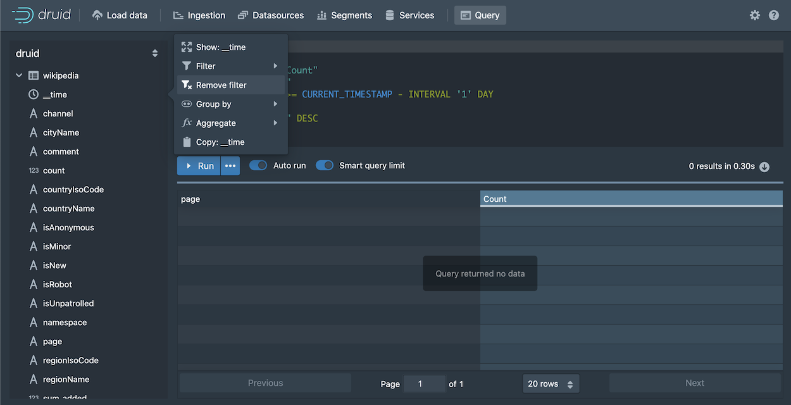

# 查询数据

本教程文档主要为了对如何在 Apache Druid 使用 SQL 进行查询进行说明。  

假设你已经完成了 [快速开始](../tutorials/index.md) 页面中的内容或者下面页面中有关的内容的内容。因为在 Apache Druid 中进行查询之前，
你需要将注入导入到 Druid 后才能够让进行下一步的操作：

* [教程：载入一个文件](../tutorials/tutorial-batch.md)
* [教程：从 Kafka 中载入流数据](../tutorials/tutorial-kafka.md)
* [教程：使用 Hadoop 载入一个文件](../tutorials/tutorial-batch-hadoop.md)

有多种方法能在 Druid 中运行 SQL 查询：从 Druid 控制台中进行查询；使用命令行工具（command line utility）进行查询查询；使用 HTTP 方式进行查询。

下面我们将会针对各种查询方式进行说明。


## 从 Druid 控制台（Druid console）中进行查询

Druid 控制台提供了视图能够让用户更加容易的在 Druid 进行查询测试，并且查看查询返回的结果。

1. 如果你的 Druid 没有启动的话，你需要先行启动 Druid 集群，然后通过你的浏览器访问 Druid 控制台。

2. 单击顶部的 **查询（Query）** 导航进入查询界面：  

   

   你可以在编辑器中直接写查询语句和脚本，同时 Query 查询输入对话框也提供了代码自动完成功能帮助你完成需要使用的查询语句。

3. 从左侧的面板中打开 wikipedia 数据源，我们将会从这里对数据源中的 page 进行查询。  

4. 单击 `page` 然后从菜单中选项 **Show:page** ： 

   

   SELECT 查询语句将会在查询编辑器中显示。但是，现在如果你进行查询的话是没有任何返回数据的，这是因为默认的查询时间为最近的一天，
   但是我们的数据已经远比这个数据老。因此我们需要删除这个过滤器（filter）。  

5. 在 datasource 的树中，单击 `__time` 然后选择 **Remove Filter** 

   

6. 单击 **Run** 来运行这个查询。

   你应该在返回的对话框中看到 2 列的数据，这个包括有 page name 和 count:

   

   Notice that the results are limited in the console to about a hundred, by default, due to the **Smart query limit** 
   feature. This helps users avoid inadvertently running queries that return an excessive amount of data, possibly
   overwhelming their system. 

7. Let's edit the query directly and take a look at a few more query building features in the editor. 
   Click in the query edit pane and make the following changes: 

   1.  Add a line after the first column, `"page"` and Start typing the name of a new column, `"countryName"`. Notice that the autocomplete menu suggests column names, functions, keywords, and more. Choose "countryName" and 
add the new column to the GROUP BY clause as well, either by name or by reference to its position, `2`.  

   2. For readability, replace `Count` column name with `Edits`, since the `COUNT()` function actually
returns the number of edits for the page. Make the same column name change in the ORDER BY clause as well. 

      The `COUNT()` function is one of many functions available for use in Druid SQL queries. You can mouse over a function name
      in the autocomplete menu to see a brief description of a function. Also, you can find more information in the Druid 
      documentation; for example, the `COUNT()` function is documented in 
      [Aggregation functions](../querying/sql.md#aggregation-functions). 

   The query should now be:

   ```sql
   SELECT
     "page",
     "countryName",
     COUNT(*) AS "Edits"
   FROM "wikipedia"
   GROUP BY 1, 2
   ORDER BY "Edits" DESC
   ``` 

   When you run the query again, notice that we're getting the new dimension,`countryName`, but for most of the rows, its value 
   is null. Let's 
   show only rows with a `countryName` value.

8. Click the countryName dimension in the left pane and choose the first filtering option. It's not exactly what we want, but
we'll edit it by hand. The new WHERE clause should appear in your query. 

9. Modify the WHERE clause to exclude results that do not have a value for countryName: 

   ```sql
   WHERE "countryName" IS NOT NULL
   ``` 
   Run the query again. You should now see the top edits by country:  

   

10. Under the covers, every Druid SQL query is translated into a query in the JSON-based _Druid native query_ format before it runs
 on data nodes. You can view the native query for this query by clicking `...` and **Explain SQL Query**. 

    While you can use Druid SQL for most purposes, familiarity with native query is useful for composing complex queries and for troubleshooting 
performance issues. For more information, see [Native queries](../querying/querying.md). 

    

     > Another way to view the explain plan is by adding EXPLAIN PLAN FOR to the front of your query, as follows:
     >
     >```sql
     >EXPLAIN PLAN FOR
     >SELECT
     >  "page",
     >  "countryName",
     >  COUNT(*) AS "Edits"
     >FROM "wikipedia"
     >WHERE "countryName" IS NOT NULL
     >GROUP BY 1, 2
     >ORDER BY "Edits" DESC
     >```
     >This is particularly useful when running queries 
     from the command line or over HTTP.


9. Finally, click  `...`  and **Edit context** to see how you can add additional parameters controlling the execution of the query execution. In the field, enter query context options as JSON key-value pairs, as described in [Context flags](../querying/query-context.md).  

That's it! We've built a simple query using some of the query builder features built into the Druid Console. The following
sections provide a few more example queries you can try. Also, see [Other ways to invoke SQL queries](#other-ways-to-invoke-sql-queries) to learn how
to run Druid SQL from the command line or over HTTP. 

## More Druid SQL examples

Here is a collection of queries to try out:

### Query over time

```sql
SELECT FLOOR(__time to HOUR) AS HourTime, SUM(deleted) AS LinesDeleted
FROM wikipedia WHERE "__time" BETWEEN TIMESTAMP '2015-09-12 00:00:00' AND TIMESTAMP '2015-09-13 00:00:00'
GROUP BY 1
```


### General group by

```sql
SELECT channel, page, SUM(added)
FROM wikipedia WHERE "__time" BETWEEN TIMESTAMP '2015-09-12 00:00:00' AND TIMESTAMP '2015-09-13 00:00:00'
GROUP BY channel, page
ORDER BY SUM(added) DESC
```


## Other ways to invoke SQL queries

### Query SQL via dsql

For convenience, the Druid package includes a SQL command-line client, located at `bin/dsql` in the Druid package root.

Let's now run `bin/dsql`; you should see the following prompt:

```bash
Welcome to dsql, the command-line client for Druid SQL.
Type "\h" for help.
dsql>
```

To submit the query, paste it to the `dsql` prompt and press enter:

```bash
dsql> SELECT page, COUNT(*) AS Edits FROM wikipedia WHERE "__time" BETWEEN TIMESTAMP '2015-09-12 00:00:00' AND TIMESTAMP '2015-09-13 00:00:00' GROUP BY page ORDER BY Edits DESC LIMIT 10;
┌──────────────────────────────────────────────────────────┬───────┐
│ page                                                     │ Edits │
├──────────────────────────────────────────────────────────┼───────┤
│ Wikipedia:Vandalismusmeldung                             │    33 │
│ User:Cyde/List of candidates for speedy deletion/Subpage │    28 │
│ Jeremy Corbyn                                            │    27 │
│ Wikipedia:Administrators' noticeboard/Incidents          │    21 │
│ Flavia Pennetta                                          │    20 │
│ Total Drama Presents: The Ridonculous Race               │    18 │
│ User talk:Dudeperson176123                               │    18 │
│ Wikipédia:Le Bistro/12 septembre 2015                    │    18 │
│ Wikipedia:In the news/Candidates                         │    17 │
│ Wikipedia:Requests for page protection                   │    17 │
└──────────────────────────────────────────────────────────┴───────┘
Retrieved 10 rows in 0.06s.
```


### Query SQL over HTTP


You can submit queries directly to the Druid Broker over HTTP. 

The tutorial package includes an example file that contains the SQL query shown above at `quickstart/tutorial/wikipedia-top-pages-sql.json`. Let's submit that query to the Druid Broker:

```bash
curl -X 'POST' -H 'Content-Type:application/json' -d @quickstart/tutorial/wikipedia-top-pages-sql.json http://localhost:8888/druid/v2/sql
```

The following results should be returned:

```json
[
  {
    "page": "Wikipedia:Vandalismusmeldung",
    "Edits": 33
  },
  {
    "page": "User:Cyde/List of candidates for speedy deletion/Subpage",
    "Edits": 28
  },
  {
    "page": "Jeremy Corbyn",
    "Edits": 27
  },
  {
    "page": "Wikipedia:Administrators' noticeboard/Incidents",
    "Edits": 21
  },
  {
    "page": "Flavia Pennetta",
    "Edits": 20
  },
  {
    "page": "Total Drama Presents: The Ridonculous Race",
    "Edits": 18
  },
  {
    "page": "User talk:Dudeperson176123",
    "Edits": 18
  },
  {
    "page": "Wikipédia:Le Bistro/12 septembre 2015",
    "Edits": 18
  },
  {
    "page": "Wikipedia:In the news/Candidates",
    "Edits": 17
  },
  {
    "page": "Wikipedia:Requests for page protection",
    "Edits": 17
  }
]
```

## Further reading

See the [Druid SQL documentation](../querying/sql.md) for more information on using Druid SQL queries.

See the [Queries documentation](../querying/querying.md) for more information on Druid native queries.

## 查询数据

本教程将以Druid SQL和Druid的原生查询格式的示例演示如何在Apache Druid中查询数据。

本教程假定您已经完成了摄取教程之一，因为我们将查询Wikipedia编辑样例数据。

* [加载本地文件](tutorial-batch.md)
* [从Kafka加载数据](./chapter-2.md)
* [从Hadoop加载数据](./chapter-3.md)

Druid查询通过HTTP发送,Druid控制台包括一个视图，用于向Druid发出查询并很好地格式化结果。

### Druid SQL查询

Druid支持SQL查询。

该查询检索了2015年9月12日被编辑最多的10个维基百科页面

```json
SELECT page, COUNT(*) AS Edits
FROM wikipedia
WHERE TIMESTAMP '2015-09-12 00:00:00' <= "__time" AND "__time" < TIMESTAMP '2015-09-13 00:00:00'
GROUP BY page
ORDER BY Edits DESC
LIMIT 10
```

让我们来看几种不同的查询方法

#### 通过控制台查询SQL

您可以通过在控制台中进行上述查询：


控制台查询视图通过内联文档提供自动补全功能。


您还可以从 `...` 选项菜单中配置要与查询一起发送的其他上下文标志。

请注意，控制台将（默认情况下）使用带Limit的SQL查询，以便可以完成诸如`SELECT * FROM wikipedia`之类的查询,您可以通过 `Smart query limit` 切换关闭此行为。


查询视图提供了可以为您编写和修改查询的上下文操作。

#### 通过dsql查询SQL

为方便起见，Druid软件包中包括了一个SQL命令行客户端，位于Druid根目录中的 `bin/dsql`

运行 `bin/dsql`, 可以看到如下：
```json
Welcome to dsql, the command-line client for Druid SQL.
Type "\h" for help.
dsql>
```
将SQl粘贴到 `dsql` 中提交查询：

```json
dsql> SELECT page, COUNT(*) AS Edits FROM wikipedia WHERE "__time" BETWEEN TIMESTAMP '2015-09-12 00:00:00' AND TIMESTAMP '2015-09-13 00:00:00' GROUP BY page ORDER BY Edits DESC LIMIT 10;
┌──────────────────────────────────────────────────────────┬───────┐
│ page                                                     │ Edits │
├──────────────────────────────────────────────────────────┼───────┤
│ Wikipedia:Vandalismusmeldung                             │    33 │
│ User:Cyde/List of candidates for speedy deletion/Subpage │    28 │
│ Jeremy Corbyn                                            │    27 │
│ Wikipedia:Administrators' noticeboard/Incidents          │    21 │
│ Flavia Pennetta                                          │    20 │
│ Total Drama Presents: The Ridonculous Race               │    18 │
│ User talk:Dudeperson176123                               │    18 │
│ Wikipédia:Le Bistro/12 septembre 2015                    │    18 │
│ Wikipedia:In the news/Candidates                         │    17 │
│ Wikipedia:Requests for page protection                   │    17 │
└──────────────────────────────────────────────────────────┴───────┘
Retrieved 10 rows in 0.06s.
```

#### 通过HTTP查询SQL

SQL查询作为JSON通过HTTP提交

教程包括一个示例文件, 该文件`quickstart/tutorial/wikipedia-top-pages-sql.json`包含上面显示的SQL查询, 我们将该查询提交给Druid Broker。

```json
curl -X 'POST' -H 'Content-Type:application/json' -d @quickstart/tutorial/wikipedia-top-pages-sql.json http://localhost:8888/druid/v2/sql
```
结果返回如下：

```json
[
  {
    "page": "Wikipedia:Vandalismusmeldung",
    "Edits": 33
  },
  {
    "page": "User:Cyde/List of candidates for speedy deletion/Subpage",
    "Edits": 28
  },
  {
    "page": "Jeremy Corbyn",
    "Edits": 27
  },
  {
    "page": "Wikipedia:Administrators' noticeboard/Incidents",
    "Edits": 21
  },
  {
    "page": "Flavia Pennetta",
    "Edits": 20
  },
  {
    "page": "Total Drama Presents: The Ridonculous Race",
    "Edits": 18
  },
  {
    "page": "User talk:Dudeperson176123",
    "Edits": 18
  },
  {
    "page": "Wikipédia:Le Bistro/12 septembre 2015",
    "Edits": 18
  },
  {
    "page": "Wikipedia:In the news/Candidates",
    "Edits": 17
  },
  {
    "page": "Wikipedia:Requests for page protection",
    "Edits": 17
  }
]
```

#### 更多Druid SQL示例

这是一组可尝试的查询:

**时间查询**

```json
SELECT FLOOR(__time to HOUR) AS HourTime, SUM(deleted) AS LinesDeleted
FROM wikipedia WHERE "__time" BETWEEN TIMESTAMP '2015-09-12 00:00:00' AND TIMESTAMP '2015-09-13 00:00:00'
GROUP BY 1
```


**聚合查询**

```json
SELECT channel, page, SUM(added)
FROM wikipedia WHERE "__time" BETWEEN TIMESTAMP '2015-09-12 00:00:00' AND TIMESTAMP '2015-09-13 00:00:00'
GROUP BY channel, page
ORDER BY SUM(added) DESC
```


**查询原始数据**

```json
SELECT user, page
FROM wikipedia WHERE "__time" BETWEEN TIMESTAMP '2015-09-12 02:00:00' AND TIMESTAMP '2015-09-12 03:00:00'
LIMIT 5
```


#### SQL查询计划

Druid SQL能够解释给定查询的查询计划, 在控制台中，可以通过 `...` 按钮访问此功能。


如果您以其他方式查询，则可以通过在Druid SQL查询之前添加 `EXPLAIN PLAN FOR` 来获得查询计划。

使用上边的一个示例：

`EXPLAIN PLAN FOR SELECT page, COUNT(*) AS Edits FROM wikipedia WHERE "__time" BETWEEN TIMESTAMP '2015-09-12 00:00:00' AND TIMESTAMP '2015-09-13 00:00:00' GROUP BY page ORDER BY Edits DESC LIMIT 10;`

```json
dsql> EXPLAIN PLAN FOR SELECT page, COUNT(*) AS Edits FROM wikipedia WHERE "__time" BETWEEN TIMESTAMP '2015-09-12 00:00:00' AND TIMESTAMP '2015-09-13 00:00:00' GROUP BY page ORDER BY Edits DESC LIMIT 10;
┌─────────────────────────────────────────────────────────────────────────────────────────────────────────────────────────────────────────────────────────────────────────────────────────────────────────────────────────────────────────────────────────────────────────────────────────────────────────────────────────────────────────────────────────────────────────────────────────────────────────────────────────────────────────────────────────────────────────────────────────────────────────────────────────────────────────────────────────┐
│ PLAN                                                                                                                                                                                                                                                                                                                                                                                                                                                                                                                                                    │
├─────────────────────────────────────────────────────────────────────────────────────────────────────────────────────────────────────────────────────────────────────────────────────────────────────────────────────────────────────────────────────────────────────────────────────────────────────────────────────────────────────────────────────────────────────────────────────────────────────────────────────────────────────────────────────────────────────────────────────────────────────────────────────────────────────────────────────────┤
│ DruidQueryRel(query=[{"queryType":"topN","dataSource":{"type":"table","name":"wikipedia"},"virtualColumns":[],"dimension":{"type":"default","dimension":"page","outputName":"d0","outputType":"STRING"},"metric":{"type":"numeric","metric":"a0"},"threshold":10,"intervals":{"type":"intervals","intervals":["2015-09-12T00:00:00.000Z/2015-09-13T00:00:00.001Z"]},"filter":null,"granularity":{"type":"all"},"aggregations":[{"type":"count","name":"a0"}],"postAggregations":[],"context":{},"descending":false}], signature=[{d0:STRING, a0:LONG}]) │
└─────────────────────────────────────────────────────────────────────────────────────────────────────────────────────────────────────────────────────────────────────────────────────────────────────────────────────────────────────────────────────────────────────────────────────────────────────────────────────────────────────────────────────────────────────────────────────────────────────────────────────────────────────────────────────────────────────────────────────────────────────────────────────────────────────────────────────────┘
Retrieved 1 row in 0.03s.
```

### 原生JSON查询

Druid的原生查询格式以JSON表示。

#### 通过控制台原生查询

您可以从控制台的"Query"视图发出原生Druid查询。

这是一个查询，可检索2015-09-12上具有最多页面编辑量的10个wikipedia页面。

```json
{
  "queryType" : "topN",
  "dataSource" : "wikipedia",
  "intervals" : ["2015-09-12/2015-09-13"],
  "granularity" : "all",
  "dimension" : "page",
  "metric" : "count",
  "threshold" : 10,
  "aggregations" : [
    {
      "type" : "count",
      "name" : "count"
    }
  ]
}
```
只需将其粘贴到控制台即可将编辑器切换到JSON模式。


#### 通过HTTP原生查询

我们在 `quickstart/tutorial/wikipedia-top-pages.json` 文件中包括了一个示例原生TopN查询。

提交该查询到Druid：

```json
curl -X 'POST' -H 'Content-Type:application/json' -d @quickstart/tutorial/wikipedia-top-pages.json http://localhost:8888/druid/v2?pretty
```

您可以看到如下的查询结果：

```json
[ {
  "timestamp" : "2015-09-12T00:46:58.771Z",
  "result" : [ {
    "count" : 33,
    "page" : "Wikipedia:Vandalismusmeldung"
  }, {
    "count" : 28,
    "page" : "User:Cyde/List of candidates for speedy deletion/Subpage"
  }, {
    "count" : 27,
    "page" : "Jeremy Corbyn"
  }, {
    "count" : 21,
    "page" : "Wikipedia:Administrators' noticeboard/Incidents"
  }, {
    "count" : 20,
    "page" : "Flavia Pennetta"
  }, {
    "count" : 18,
    "page" : "Total Drama Presents: The Ridonculous Race"
  }, {
    "count" : 18,
    "page" : "User talk:Dudeperson176123"
  }, {
    "count" : 18,
    "page" : "Wikipédia:Le Bistro/12 septembre 2015"
  }, {
    "count" : 17,
    "page" : "Wikipedia:In the news/Candidates"
  }, {
    "count" : 17,
    "page" : "Wikipedia:Requests for page protection"
  } ]
} ]
```

### 进一步阅读

[查询文档](../querying/makeNativeQueries.md)有更多关于Druid原生JSON查询的信息
[Druid SQL文档](../querying/druidsql.md)有更多关于Druid SQL查询的信息