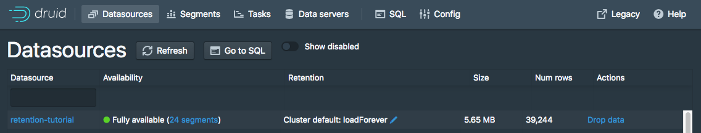
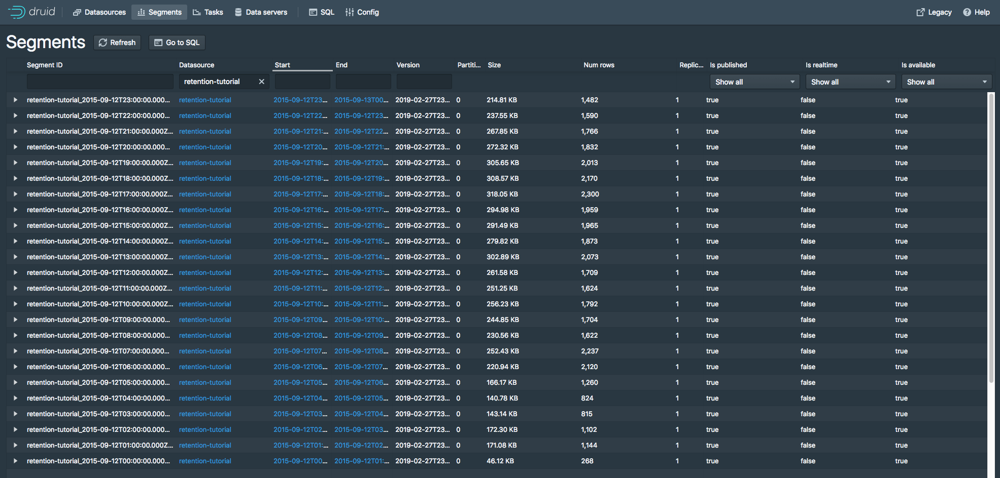
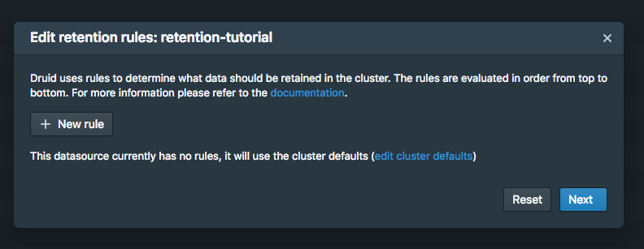
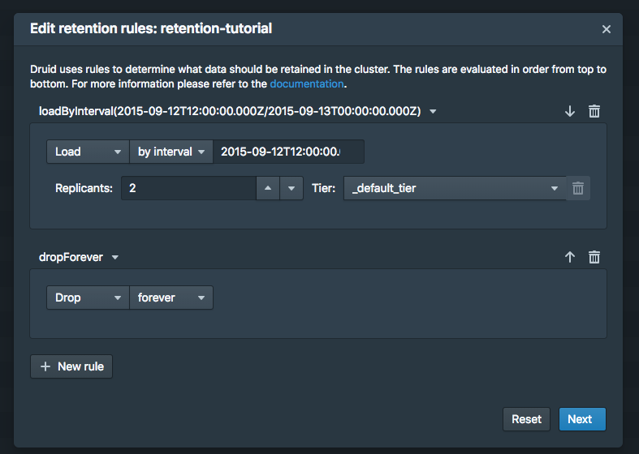
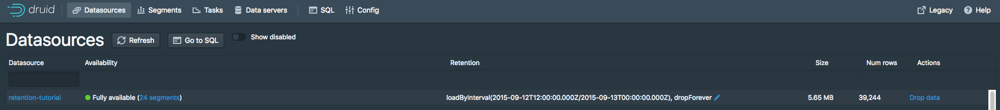
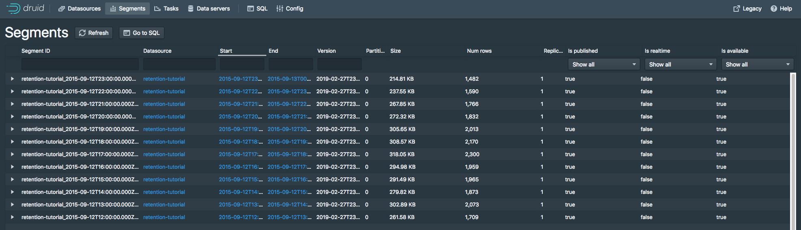

# 数据保留规则
本教程对如何在数据源上配置数据保留规则进行了说明，数据保留规则主要定义为数据的保留（retained）或者卸载（dropped）的时间。

!> 请注意，dropped 我们使用了中文 `卸载` 来进行翻译。但是 Druid 对卸载的数据是会从段里面删除掉的，如果你还需要这些数据的话，你需要将数据重新导入。

假设你已经完成了 [快速开始](../tutorials/index.md) 页面中的内容或者下面页面中有关的内容，并且你的 Druid 实例已经在你的本地的计算机上运行了。

同时，如果你已经完成了下面内容的阅读的话将会更好的帮助你理解 Roll-up 的相关内容。

* [教程：载入一个文件](../tutorials/tutorial-batch.md)
* [教程：查询数据](../tutorials/tutorial-query.md)


## 载入示例数据

在本教程中，我们将使用W Wikipedia 编辑的示例数据，其中包含一个摄取任务规范，它将为输入数据每个小时创建一个单独的段。

数据摄取导入规范位于 `quickstart/tutorial/retention-index.json` 文件中。让我们提交这个规范，将创建一个名称为 `retention-tutorial` 的数据源。

```bash
bin/post-index-task --file quickstart/tutorial/retention-index.json --url http://localhost:8081
```

摄取完成后，在浏览器中访问 http://localhost:8888/unified-console.html#datasources](http://localhost:8888/unified-console.html#datasources) 
然后访问 Druid 的控制台数据源视图。

此视图显示可用的数据源以及每个数据源定义的数据保留规则摘要。




当前，针对 `retention-tutorial` 数据源还没有设置数据保留规则。

需要注意的是，针对集群部署方式会配置一个默认的数据保留规则：永久载入 2 个副本并且替换进 `_default_tier`（load forever with 2 replicas in `_default_tier`）。ith 2 replicas in `_default_tier`.

这意味着无论时间戳如何，所有数据都将加载，并且每个段将复制到两个 Historical 进程的默认层（default tier）中。

在本教程中，我们将暂时忽略分层（tiering）和冗余（redundancy）的概念。

通过单击 `retention-tutorial` 数据源 "Fully Available" 链接边上的 "24 Segments" 来查看段（segments）信息。

段视图 ([http://localhost:8888/unified-console.html#segments](http://localhost:8888/unified-console.html#segments)) p

[Segment视图](http://localhost:8888/unified-console.html#segments) 提供了一个数据源的段（segment）信息。
本页显示了有 24 个段，每个段包括有 2015-09-12 每一个小时的数据。



## 设置保留规则

假设我们想卸载 2015年9月12日 前 12 小时的数据，保留 2015年9月12日后 12 小时的数据。

进入 [datasources view](http://localhost:8888/unified-console.html#datasources) 页面，然后单击 `Cluster default: loadForever` 
边上的的蓝色铅笔，然后为数据源选择 `retention-tutorial` 。

一个针对当前数据源的数据保留策略窗口将会显示出来：



单击 `+ New rule` 按钮 2 次。

在上层的输入框中输入 `Load` 然后选择 `by interval`，然后输入 在 `by interval` 边上的对话框中输入 `2015-09-12T12:00:00.000Z/2015-09-13T00:00:00.000Z`。
副本（Replicas）在 `_default_tier` 中可以设置为默认为 2。

然后在下侧的对话框中选择 `Drop` 和 `forever`。

设置的规则应该看起来和下面这样是一样的：



单击 `Next`。 规则配置进程将要求提供用户名和注释，以及修改的日志以便于记录。你可以同时输入字符 `tutorial`，当然你也可以用自己的字符。

单击 `Save`, 随后你就可以在 datasources 视图中看到设置的新的规则了。



给集群几分钟时间来应用修改的保留规则。然后在 Druid 控制台中进入 [segments view](http://localhost:8888/unified-console.html#segments)。
这时候你应该发现 2015-09-12 前 12 小时的段已经消失了。



针对上面的修改，新生成的保留规则链如下：

1. loadByInterval 2015-09-12T12/2015-09-13 (12 hours)

2. dropForever

3. loadForever (default rule)

规则链是自上而下计算的，默认规则链始终添加在规则链的最底部。

根据我们刚才教程使用的规则创建的内容，链在指定的12小时间隔内加载数据。

如果数据不在 12 小时内的话，那么规则链将会随后对 `dropForever` 进行评估 —— 评估的结果就是卸载所有的数据。

`dropForever` 终止了规则链，并且覆盖了默认的 `loadForever` 规则，因此最后的 `loadForever` 在这个规则链中永远不会实现到。

请注意，在本教程中，我们定义了一个特定间隔的加载规则。

如果希望根据数据的生命周期来保留保留数据（例如，保留从过去到现在 3 个月以内的数据），那么你应该定义一个周期性加载规则（Period Load Rule）。

## 延伸阅读
* [载入规则（Load rules）](../operations/rule-configuration.md)